# UX Design Specification Tact

**Author:** TomiSakae
**Date:** 2025-12-14

---

<!-- UX design content will be appended sequentially through collaborative workflow steps -->

## Executive Summary

### Project Vision

**Tact** là hệ thống quản lý cửa hàng điện thoại O2O thế hệ mới, kết hợp **Awwwards-level design aesthetics** với **mobile-first performance**. Lấy cảm hứng từ Nike's sophisticated simplicity, Apple's premium minimalism, và Stripe's smooth interactions, Tact tạo ra trải nghiệm mua sắm điện thoại **đẹp tinh tế, mượt mà, và đáng tin cậy** - khác biệt hoàn toàn với các đối thủ như TGDĐ, FPT Shop.

**Design Philosophy: "Sophisticated Simplicity"**

-   Đẹp nhưng không phô trương (Nike-inspired whitespace)
-   Tinh tế nhưng không phức tạp (Apple-inspired minimalism)
-   Mượt mà nhưng không nặng (CSS-first animations)
-   Premium feeling với mass market accessibility (Stripe-inspired polish)

**Performance Commitment:**

-   < 2s page load time
-   60fps smooth animations
-   < 2MB page size
-   Mobile-first, always

### Target Users

**1. Khách hàng (Primary Focus cho Awwwards Design)**

**Gen Z (18-25 tuổi) - 30% thị trường**

-   Tech-savvy, appreciate good design
-   Influenced by aesthetics và social media
-   Expect smooth, fast mobile experiences
-   Budget: 5-15 triệu (mid-range phones)
-   **UX Needs**: Visual appeal, speed, social proof, easy checkout

**Millennials (26-40 tuổi) - 40% thị trường**

-   Research-heavy, compare carefully
-   Value both aesthetics và functionality
-   65% có hành vi ROPO (Research Online, Purchase Offline)
-   Budget: 10-30 triệu (mid to flagship)
-   **UX Needs**: Detailed info, trust signals, seamless O2O, quick decisions

**2. Sales Staff (Functional Focus)**

-   Cần POS interface nhanh < 5 phút/transaction
-   Không cần fancy, cần efficient
-   Mobile/tablet POS support
-   **UX Needs**: Speed, clarity, minimal clicks

**3. Warehouse/Manager/Admin (Power User Focus)**

-   Cần tools mạnh mẽ, data-rich
-   Dashboard với insights actionable
-   **UX Needs**: Information density, quick actions, powerful filters

### Key Design Challenges

**1. Performance-First Awwwards Design (Critical)**

-   **Challenge**: Tạo visual richness mà không sacrifice performance
-   **Constraint**: < 2s page load, 60fps animations trên mobile
-   **Approach**:
    -   **CSS-first animations** (transforms, transitions, filters)
    -   **Intersection Observer API** cho scroll effects (native, performant)
    -   **Tailwind CSS 4** với native CSS features
    -   **Lazy loading** everything below fold
    -   **WebP images** với responsive srcset
    -   **No heavy JS libraries** (no GSAP, no Three.js)

**2. Mobile-First Sophistication (Nike + Apple Inspired)**

-   **Challenge**: Awwwards aesthetics trên small screens
-   **Constraint**: 375px width, touch interactions, thumb-zone
-   **Approach**:
    -   Design cho mobile trước, scale up cho desktop
    -   Touch targets 44x44px minimum
    -   Bottom navigation (app-like, thumb-friendly)
    -   Swipe gestures cho galleries
    -   One-handed usage optimization

**3. Dual Experience Design**

-   **Customer Site**: Nike-inspired sophistication + Stripe polish
    -   Whitespace generous
    -   Product-focused storytelling
    -   Smooth micro-interactions
    -   Premium typography
-   **Admin Site**: Clean, functional, DaisyUI components
    -   Information-dense
    -   Efficient workflows
    -   Clear hierarchy

**4. Trust + Premium Feeling (Apple-Inspired)**

-   **Challenge**: 85% khách hàng lo ngại hàng giả
-   **Approach**:
    -   Premium typography (Inter Variable Font)
    -   Sophisticated color palette (blues, warm grays)
    -   High-quality product photography
    -   Prominent trust badges (IMEI, warranty, chính hãng)
    -   Subtle animations tạo polish (CSS-only)

**5. Vietnamese Market Adaptation**

-   **Challenge**: International aesthetics + local preferences
-   **Approach**:
    -   Information-rich nhưng organized beautifully
    -   Vibrant colors nhưng sophisticated
    -   Vietnamese typography tested (diacritics)
    -   Local payment methods prominent (MoMo, ZaloPay)

### Design Opportunities

**1. Nike-Inspired Product Showcase**

-   **Instant color preview** trên product grids (hover effects)
-   **360° product views** với swipe gestures
-   **Product videos** auto-play on hover (mobile: tap)
-   **Generous whitespace** (biophilia effect)
-   **Earthy color palette** (browns, grays, whites)

**2. Apple-Inspired Premium Details**

-   **Premium typography** (Inter Variable Font)
-   **Minimalist product pages** (product-focused)
-   **Smooth transitions** (cubic-bezier easing)
-   **High-quality photography** (professional shots)
-   **Attention to detail** (every pixel matters)

**3. Stripe-Inspired Micro-Interactions**

-   **Button hover states** (subtle transforms, shadows)
-   **Form interactions** (instant validation feedback)
-   **Loading states** (skeleton screens, pulse animations)
-   **Success moments** (checkmarks, subtle celebrations)
-   **Smooth page transitions** (fade, slide effects)

**4. Mobile-Native Patterns (Mobbin-Inspired)**

-   **Bottom sheet modals** (thumb-friendly)
-   **Swipe to delete** (cart items)
-   **Pull to refresh** (order status)
-   **Floating action button** (add to cart, sticky)
-   **Haptic feedback** (iOS/Android native)

**5. Timeline as Storytelling**

-   **Vertical timeline** (mobile-optimized)
-   **Animated progress** (CSS keyframes)
-   **Status icons** (subtle animations)
-   **Emotional copy** ("Đơn hàng đang trên đường đến bạn! 🚚")
-   **Celebration moments** (confetti on order completed)

**6. Trust-Building Design Elements**

-   **IMEI badge** prominent, animated on hover
-   **Warranty countdown** visual (progress bar)
-   **Chính hãng seal** với premium styling
-   **Customer reviews** với star animations
-   **Security badges** (SSL, payment methods)

**7. Performance Optimization Strategies**

-   **Critical CSS inline** (above fold)
-   **Lazy load images** (native loading="lazy")
-   **Defer non-critical JS**
-   **Preload key assets** (fonts, hero image)
-   **Service Worker** cho offline support
-   **Code splitting** (Vite automatic)

## Core User Experience

### Defining Experience

**Tact** có **dual core experience** phục vụ 2 nhóm người dùng chính với mục tiêu khác nhau:

**Customer Experience: "Tìm → Tin → Mua"**

-   **Core Loop**: Browse products → View details → Add to cart → Quick checkout
-   **Value Proposition**: Tìm điện thoại chính hãng với giá tốt, mua nhanh, tin tưởng hoàn toàn
-   **Success Metric**: Checkout completion < 5 phút, CSAT 4.5/5 stars

**Sales Experience: "Nhanh → Chính xác → Hoàn thành"**

-   **Core Loop**: Find customer → Select products → Scan IMEI → Complete payment
-   **Value Proposition**: Bán hàng nhanh hơn 50% so với hệ thống cũ, không sai sót
-   **Success Metric**: Transaction completion < 5 phút, 100% IMEI accuracy

### Platform Strategy

**Multi-Platform Web Application:**

**Customer Platform (Mobile-First Web)**

-   **Primary**: Mobile web (375px-768px) - 70%+ traffic
-   **Secondary**: Desktop web (1024px+) - 30% traffic
-   **Technology**: Laravel Blade + Tailwind CSS 4 + DaisyUI 5
-   **Performance**: < 2s load time, 60fps animations
-   **Offline**: Service Worker cho basic caching
-   **Future**: Native app (post-MVP) nếu cần push notifications

**Sales Platform (Tablet-Optimized Web)**

-   **Primary**: iPad/Android tablets (landscape 1024px+)
-   **Technology**: Same stack, optimized cho touch + speed
-   **Offline**: Critical - POS phải hoạt động khi mất internet
-   **Hardware**: Bluetooth barcode scanner, receipt printer

**Admin Platform (Desktop Web)**

-   **Primary**: Desktop/Laptop (1280px+)
-   **Technology**: Same stack, DaisyUI components
-   **Focus**: Information density, powerful tools

### Effortless Interactions

**Customer Effortless Moments:**

1. **Product Discovery** (Zero Friction)

    - Search bar prominent, autocomplete instant
    - Filters apply without page reload
    - Sort options 1-click
    - Infinite scroll hoặc smart pagination

2. **Product Comparison** (No Tab Juggling)

    - Hover preview colors/variants
    - Specs accordion expand smooth
    - Compare button → side-by-side view
    - No need to open multiple tabs

3. **Add to Cart** (Instant Feedback)

    - 1-tap add to cart
    - Micro-animation confirmation
    - Cart badge update instant
    - Continue shopping seamless

4. **Checkout** (Minimal Steps)
    - Auto-fill saved addresses
    - Mobile payment integration (Apple Pay, Google Pay)
    - Voucher apply instant
    - 1-page checkout preferred

**Sales Effortless Moments:**

1. **Customer Lookup** (< 3 seconds)

    - Type phone number → instant results
    - Customer history visible immediately
    - Points balance shown
    - Create new customer 1-click

2. **Product Selection** (Scan & Done)

    - Barcode scan → auto-add to cart
    - Or type SKU → autocomplete
    - Stock check real-time
    - Variants select easy

3. **IMEI Recording** (Zero Manual Entry)

    - Scan IMEI barcode → auto-fill
    - Or camera scan IMEI text
    - Validation instant
    - No typos possible

4. **Payment** (1-Click Complete)
    - Select payment method
    - Apply voucher/points auto
    - Print receipt instant
    - Transaction complete < 1 second

### Critical Success Moments

**Customer Success Moments:**

1. **Trust Moment** (First 10 seconds)

    - Premium design → "This looks professional"
    - Trust badges visible → "This is legit"
    - High-quality photos → "These are real products"
    - **Outcome**: User stays and explores

2. **Confidence Moment** (Product Page)

    - IMEI tracking badge → "This is authentic"
    - Warranty info clear → "I'm protected"
    - Reviews visible → "Others trust this"
    - **Outcome**: User adds to cart

3. **Delight Moment** (Checkout)

    - Fast, smooth process → "Wow, this is easy!"
    - Mobile payment works → "So convenient!"
    - Order confirmation instant → "Done!"
    - **Outcome**: User completes purchase

4. **Satisfaction Moment** (Post-Purchase)
    - Timeline visual → "I know where my order is"
    - IMEI on receipt → "I have proof"
    - Can track easily → "I feel in control"
    - **Outcome**: User becomes repeat customer

**Sales Success Moments:**

1. **Efficiency Moment** (Every Transaction)

    - Find customer < 3 seconds → "Fast!"
    - Add products < 10 seconds → "Easy!"
    - Complete payment < 1 minute → "Done!"
    - **Outcome**: Can serve more customers

2. **Confidence Moment** (IMEI Recording)

    - Scan works perfectly → "No mistakes!"
    - Auto-record to system → "Accurate!"
    - Print on receipt → "Complete!"
    - **Outcome**: No audit issues

3. **Relief Moment** (End of Day)
    - No manual reconciliation → "Saved time!"
    - Reports auto-generated → "Easy!"
    - No discrepancies → "Perfect!"
    - **Outcome**: Less stress, more satisfaction

### Experience Principles

**Guiding Principles for All UX Decisions:**

**1. Speed is Trust**

-   Fast load times = professional feeling
-   Instant feedback = confidence
-   Quick checkout = satisfaction
-   **Implementation**: < 2s load, 60fps animations, instant interactions

**2. Clarity Builds Confidence**

-   Clear information = trust
-   Visible IMEI/warranty = authenticity
-   Transparent pricing = honesty
-   **Implementation**: Prominent trust signals, no hidden info

**3. Simplicity Enables Efficiency**

-   Fewer steps = faster completion
-   Clear hierarchy = easy navigation
-   Smart defaults = less thinking
-   **Implementation**: Minimal clicks, auto-fill, 1-page flows

**4. Beauty Signals Quality**

-   Premium design = quality products
-   Smooth animations = attention to detail
-   Consistent styling = professionalism
-   **Implementation**: Nike/Apple-inspired aesthetics, CSS-first polish

**5. Mobile-First, Always**

-   Design for thumb = accessibility
-   Touch-optimized = usability
-   Performance-first = satisfaction
-   **Implementation**: 375px base, touch targets 44px+, lazy loading

## Desired Emotional Response

### Primary Emotional Goals

**Customer Emotional Goals:**

**"Premium yet Accessible"**

-   First impression: "Wow, this looks professional and beautiful!"
-   Browsing: "This feels like a premium brand, but prices are reasonable"
-   Outcome: Elevated shopping experience without intimidation

**"Confident and Trusting"**

-   Product viewing: "I can trust this is authentic (IMEI tracking visible)"
-   Checkout: "I feel safe giving my information here"
-   Outcome: Zero hesitation to complete purchase

**"Delighted by Ease"**

-   Interaction: "This is so smooth and fast!"
-   Completion: "That was easier than I expected!"
-   Outcome: Positive surprise, want to share experience

**"In Control and Informed"**

-   Post-purchase: "I know exactly where my order is"
-   Tracking: "I can see everything clearly"
-   Outcome: Peace of mind, reduced anxiety

**Sales Staff Emotional Goals:**

**"Efficient and Empowered"**

-   Every transaction: "I'm serving customers faster than ever"
-   Daily work: "I can handle more customers without stress"
-   Outcome: Job satisfaction, confidence

**"Confident and Accurate"**

-   IMEI recording: "No mistakes, everything is recorded correctly"
-   End of day: "No discrepancies, no manual work"
-   Outcome: Professional pride, reduced anxiety

**"Accomplished and Valued"**

-   Transaction complete: "Done! Next customer please"
-   Performance: "I can see my results clearly"
-   Outcome: Sense of achievement

### Emotional Journey Mapping

**Customer Emotional Journey:**

**Stage 1: Discovery (0-10 seconds)**

-   **Emotion**: Impressed, Curious
-   **Trigger**: Premium design, beautiful product photos
-   **Thought**: "This looks different from other phone stores"
-   **Design Goal**: Create immediate positive impression

**Stage 2: Exploration (10 seconds - 2 minutes)**

-   **Emotion**: Confident, Engaged
-   **Trigger**: Clear navigation, smooth interactions, trust signals
-   **Thought**: "I can find what I need easily"
-   **Design Goal**: Maintain engagement, build trust

**Stage 3: Product Evaluation (2-5 minutes)**

-   **Emotion**: Trusting, Informed
-   **Trigger**: IMEI badge, warranty info, detailed specs, reviews
-   **Thought**: "This is authentic, I'm protected"
-   **Design Goal**: Convert interest to intent

**Stage 4: Decision (5-7 minutes)**

-   **Emotion**: Excited, Ready
-   **Trigger**: Good price, clear info, easy add-to-cart
-   **Thought**: "I want this, let's buy it!"
-   **Design Goal**: Remove friction, encourage action

**Stage 5: Checkout (7-10 minutes)**

-   **Emotion**: Delighted, Satisfied
-   **Trigger**: Fast process, mobile payment, instant confirmation
-   **Thought**: "Wow, that was so easy!"
-   **Design Goal**: Exceed expectations, create delight

**Stage 6: Post-Purchase (Days after)**

-   **Emotion**: Satisfied, In Control
-   **Trigger**: Visual timeline, clear tracking, IMEI on receipt
-   **Thought**: "I know where my order is, I have proof"
-   **Design Goal**: Maintain satisfaction, encourage return

**Sales Staff Emotional Journey:**

**Stage 1: Start of Day**

-   **Emotion**: Ready, Focused
-   **Trigger**: Clean interface, fast login
-   **Thought**: "Let's serve customers efficiently today"

**Stage 2: During Transactions (Repeated)**

-   **Emotion**: Efficient, Confident
-   **Trigger**: Fast customer lookup, quick product selection, smooth IMEI scan
-   **Thought**: "This is so much faster than the old system"

**Stage 3: End of Day**

-   **Emotion**: Accomplished, Relieved
-   **Trigger**: Auto-generated reports, no manual reconciliation
-   **Thought**: "Done! No extra work needed"

### Micro-Emotions

**Confidence vs. Confusion:**

-   ✅ **Build Confidence**: Clear labels, obvious CTAs, breadcrumbs, progress indicators
-   ✅ **Prevent Confusion**: Consistent patterns, helpful tooltips, clear error messages
-   **Design Approach**: Every interaction should feel obvious and natural

**Trust vs. Skepticism:**

-   ✅ **Build Trust**: IMEI badges prominent, warranty info clear, security badges visible
-   ✅ **Prevent Skepticism**: Transparent pricing, no hidden fees, clear policies
-   **Design Approach**: Over-communicate authenticity and protection

**Delight vs. Satisfaction:**

-   ✅ **Create Delight**: Smooth animations, instant feedback, celebration moments (order complete)
-   ✅ **Ensure Satisfaction**: Task completion clear, confirmation messages, success states
-   **Design Approach**: Exceed expectations with polish and speed

**Accomplishment vs. Frustration:**

-   ✅ **Foster Accomplishment**: Clear progress, completion feedback, visual rewards
-   ✅ **Prevent Frustration**: Fast loading, no errors, helpful recovery, clear next steps
-   **Design Approach**: Make every action feel successful

**Excitement vs. Anxiety:**

-   ✅ **Generate Excitement**: Beautiful visuals, smooth interactions, premium feeling
-   ✅ **Reduce Anxiety**: Clear information, visible security, easy cancellation
-   **Design Approach**: Balance aspiration with reassurance

### Design Implications

**Emotion → UX Design Connections:**

**1. "Premium yet Accessible" → Visual Design**

-   **Implementation**:
    -   Nike-inspired whitespace and clean layouts
    -   Apple-inspired typography (Inter Variable Font)
    -   High-quality product photography
    -   Sophisticated color palette (blues, warm grays)
    -   Subtle animations (CSS-only, performant)

**2. "Confident and Trusting" → Trust Signals**

-   **Implementation**:
    -   IMEI tracking badge on every product card
    -   Warranty countdown timer on product pages
    -   "Chính hãng" seal prominent
    -   Security badges in footer (SSL, payment methods)
    -   Customer reviews with verified purchase badges

**3. "Delighted by Ease" → Interaction Design**

-   **Implementation**:
    -   Instant feedback on all actions (< 100ms)
    -   Smooth transitions (cubic-bezier easing)
    -   One-tap add to cart with animation
    -   Auto-fill forms where possible
    -   Mobile payment integration (Apple Pay, Google Pay)

**4. "In Control and Informed" → Information Architecture**

-   **Implementation**:
    -   Visual timeline for order tracking
    -   Real-time status updates
    -   Clear progress indicators
    -   Easy order cancellation (pending orders)
    -   Detailed order history with IMEI

**5. "Efficient and Empowered" → POS Design**

-   **Implementation**:
    -   Customer lookup < 3 seconds
    -   Barcode scan auto-add products
    -   IMEI scan auto-fill
    -   One-click payment completion
    -   Keyboard shortcuts for power users

### Emotional Design Principles

**Guiding Principles for Creating Desired Emotions:**

**1. First Impressions Matter (0-10 seconds)**

-   Premium visual design creates immediate trust
-   Fast load time signals professionalism
-   Beautiful product photos inspire desire
-   **Metric**: 80%+ users stay beyond 10 seconds

**2. Clarity Reduces Anxiety**

-   Clear labels eliminate confusion
-   Obvious CTAs remove hesitation
-   Transparent pricing builds trust
-   **Metric**: < 5% support tickets about "how to use"

**3. Speed Creates Delight**

-   < 2s page load exceeds expectations
-   Instant feedback feels magical
-   Quick checkout surprises positively
-   **Metric**: 4.5/5 stars for "ease of use"

**4. Polish Signals Quality**

-   Smooth animations show attention to detail
-   Consistent styling builds confidence
-   Error-free experience creates trust
-   **Metric**: NPS > 50

**5. Control Empowers Users**

-   Visible order status reduces anxiety
-   Easy cancellation builds trust
-   Clear information enables decisions
-   **Metric**: < 10% cart abandonment

**6. Recognition Motivates Staff**

-   Performance visibility drives efficiency
-   Clear metrics show accomplishment
-   Fast tools enable success
-   **Metric**: 90%+ staff satisfaction

## UX Pattern Analysis & Inspiration

### Inspiring Products Analysis

**1. Nike Digital Design System** ⭐⭐⭐⭐⭐

**What They Do Well:**

-   **Instant Color Preview**: Hover trên product card → xem tất cả color variants ngay lập tức
-   **Product Videos Auto-Play**: Hover = video play, không cần click
-   **360° Product Views**: 4+ images từ mọi góc độ
-   **Generous Whitespace**: Biophilia effect, breathable design
-   **Product-Focused**: Mọi thứ phục vụ cho việc showcase sản phẩm

**Transferable Patterns for Tact:**

-   ✅ Instant color/storage preview trên product cards
-   ✅ Whitespace generous cho premium feeling
-   ✅ Product-first approach (ảnh lớn, rõ nét)
-   ✅ Earthy color palette (browns, grays, whites)

**2. Apple Product Pages** ⭐⭐⭐⭐⭐

**What They Do Well:**

-   **Premium Typography**: SF Pro font, perfect hierarchy
-   **Minimalist Product Pages**: Product là star, không distraction
-   **Smooth Transitions**: Cubic-bezier easing, buttery smooth
-   **High-Quality Photography**: Professional shots, consistent lighting
-   **Attention to Detail**: Every pixel matters

**Transferable Patterns for Tact:**

-   ✅ Inter Variable Font cho premium typography
-   ✅ Minimalist product detail pages
-   ✅ Smooth transitions (0.3s cubic-bezier)
-   ✅ High-quality product photography requirement
-   ✅ Pixel-perfect implementation

**3. Stripe Micro-Interactions** ⭐⭐⭐⭐

**What They Do Well:**

-   **Button Hover States**: Subtle transforms + shadows
-   **Form Interactions**: Instant validation feedback
-   **Loading States**: Skeleton screens, pulse animations
-   **Success Moments**: Checkmarks, subtle celebrations
-   **Smooth Page Transitions**: Fade, slide effects

**Transferable Patterns for Tact:**

-   ✅ CSS-only hover effects (transforms, shadows)
-   ✅ Instant form validation
-   ✅ Skeleton screens cho loading
-   ✅ Success animations (order complete)
-   ✅ Page transitions smooth

**4. Mobbin Mobile Patterns** ⭐⭐⭐⭐

**What They Do Well:**

-   **Bottom Sheet Modals**: Thumb-friendly, easy to dismiss
-   **Swipe Gestures**: Natural cho galleries
-   **Floating Action Buttons**: Always accessible
-   **Pull to Refresh**: Intuitive update mechanism
-   **Haptic Feedback**: Tactile confirmation

**Transferable Patterns for Tact:**

-   ✅ Bottom navigation bar (app-like)
-   ✅ Swipe galleries cho product images
-   ✅ Floating "Add to Cart" button
-   ✅ Pull to refresh order status
-   ✅ Haptic feedback on actions

### Transferable UX Patterns

**Navigation Patterns:**

**1. Bottom Navigation (Mobile App Pattern)**

-   **Source**: Mobbin mobile apps
-   **Application**: Customer mobile site
-   **Implementation**: Fixed bottom bar với 4-5 key actions (Home, Search, Cart, Account)
-   **Benefit**: Thumb-friendly, always accessible

**2. Sticky Search Bar (Nike Pattern)**

-   **Source**: Nike mobile site
-   **Application**: Product listing pages
-   **Implementation**: Search bar sticky at top, always visible
-   **Benefit**: Quick product search without scrolling back

**3. Breadcrumbs (Apple Pattern)**

-   **Source**: Apple product pages
-   **Application**: Product detail pages
-   **Implementation**: Clear path back (Home > Điện thoại > iPhone > iPhone 15 Pro)
-   **Benefit**: Easy navigation, clear context

**Interaction Patterns:**

**1. Instant Preview (Nike Pattern)**

-   **Source**: Nike product grids
-   **Application**: Tact product cards
-   **Implementation**: Hover/tap → show color/storage variants instantly
-   **Benefit**: Quick comparison without page navigation

**2. Smooth Accordion (Apple Pattern)**

-   **Source**: Apple product specs
-   **Application**: Tact product specifications
-   **Implementation**: Expand/collapse specs với smooth animation
-   **Benefit**: Information density without overwhelming

**3. One-Tap Add to Cart (Stripe Pattern)**

-   **Source**: Stripe checkout
-   **Application**: Tact product pages
-   **Implementation**: Large button, instant feedback, cart badge update
-   **Benefit**: Frictionless adding, clear confirmation

**4. Swipe Gallery (Mobbin Pattern)**

-   **Source**: Mobile apps
-   **Application**: Tact product images
-   **Implementation**: Swipe left/right cho product photos
-   **Benefit**: Natural mobile interaction

**Visual Patterns:**

**1. Generous Whitespace (Nike Pattern)**

-   **Source**: Nike layouts
-   **Application**: All Tact pages
-   **Implementation**: Padding generous, breathing room
-   **Benefit**: Premium feeling, focus on content

**2. Premium Typography (Apple Pattern)**

-   **Source**: Apple product pages
-   **Application**: All Tact text
-   **Implementation**: Inter Variable Font, clear hierarchy
-   **Benefit**: Readability, sophistication

**3. Subtle Animations (Stripe Pattern)**

-   **Source**: Stripe interactions
-   **Application**: All Tact interactions
-   **Implementation**: CSS transforms, 0.3s transitions
-   **Benefit**: Polish, delight

**4. Trust Badges (E-commerce Best Practice)**

-   **Source**: Top e-commerce sites
-   **Application**: Tact product pages, footer
-   **Implementation**: IMEI badge, warranty seal, security badges
-   **Benefit**: Build trust, reduce anxiety

### Anti-Patterns to Avoid

**1. Information Overload (TGDĐ Anti-Pattern)**

-   **Problem**: Quá nhiều info trên 1 screen, overwhelming
-   **Why Avoid**: Conflicts với "Sophisticated Simplicity"
-   **Instead**: Progressive disclosure, accordion specs

**2. Slow Loading (Common E-commerce Mistake)**

-   **Problem**: Heavy images, no lazy loading → slow page
-   **Why Avoid**: Kills "Speed is Trust" principle
-   **Instead**: WebP images, lazy loading, < 2s load time

**3. Hidden Navigation (Mobile App Mistake)**

-   **Problem**: Hamburger menu ẩn tất cả, khó tìm
-   **Why Avoid**: Conflicts với "Clarity Builds Confidence"
-   **Instead**: Bottom navigation cho key actions, hamburger cho secondary

**4. Unclear CTAs (Common UX Mistake)**

-   **Problem**: Buttons không rõ ràng, nhiều options confusing
-   **Why Avoid**: Creates hesitation, reduces conversion
-   **Instead**: One primary CTA per screen, clear hierarchy

**5. No Feedback (Interaction Mistake)**

-   **Problem**: Click button, không biết có work không
-   **Why Avoid**: Creates anxiety, reduces confidence
-   **Instead**: Instant feedback (< 100ms), loading states, success confirmation

**6. Desktop-First Mobile (Responsive Mistake)**

-   **Problem**: Desktop design squeezed vào mobile
-   **Why Avoid**: Poor mobile UX, conflicts với mobile-first
-   **Instead**: Design cho 375px trước, scale up cho desktop

### Design Inspiration Strategy

**What to Adopt (Use As-Is):**

**1. Nike's Instant Preview Pattern**

-   **Why**: Perfect cho phone retail (colors, storage variants)
-   **Implementation**: Hover/tap product card → show variants grid
-   **Timeline**: Week 5-6 (advanced features)

**2. Apple's Premium Typography**

-   **Why**: Aligns với "Beauty Signals Quality"
-   **Implementation**: Inter Variable Font, clear hierarchy
-   **Timeline**: Week 1-2 (foundation)

**3. Stripe's Micro-Interactions**

-   **Why**: Creates delight without performance cost
-   **Implementation**: CSS-only hover effects, smooth transitions
-   **Timeline**: Week 3-4 (polish)

**4. Mobbin's Bottom Navigation**

-   **Why**: Mobile-first, thumb-friendly
-   **Implementation**: Fixed bottom bar với key actions
-   **Timeline**: Week 3-4 (mobile optimization)

**What to Adapt (Modify for Tact):**

**1. Nike's Whitespace → Balanced Whitespace**

-   **Adaptation**: Generous nhưng không quá minimal (Vietnamese market prefers info-rich)
-   **Reason**: Balance international aesthetics với local preferences

**2. Apple's Minimalism → Informed Minimalism**

-   **Adaptation**: Clean design nhưng show enough info (specs, warranty, IMEI)
-   **Reason**: Trust requires transparency, not just beauty

**3. Stripe's Gradients → Subtle Accents**

-   **Adaptation**: Use gradients sparingly (CTAs, highlights only)
-   **Reason**: Maintain sophistication, avoid trendy look

**What to Avoid (Don't Use):**

**1. Heavy Animations (Three.js, WebGL)**

-   **Reason**: Conflicts với performance-first (< 2s load)
-   **Alternative**: CSS-only animations

**2. Infinite Scroll (Some E-commerce Sites)**

-   **Reason**: Can be disorienting, hard to find products again
-   **Alternative**: Smart pagination với "Load More" button

**3. Auto-Playing Videos (Some Retail Sites)**

-   **Reason**: Slow page load, annoying on mobile
-   **Alternative**: Tap to play, or hover on desktop only

## Design System Foundation

### Design System Choice

**Selected: Tailwind CSS 4 + DaisyUI 5**

**Foundation Stack:**

-   **Tailwind CSS 4**: Utility-first CSS framework
-   **DaisyUI 5**: Component library built on Tailwind
-   **Laravel Blade**: Template engine for component composition
-   **Vite**: Asset bundling and optimization

### Rationale for Selection

**Why Tailwind CSS 4 + DaisyUI 5 is Perfect for Tact:**

**1. Performance-First Architecture**

-   ✅ **CSS-Only**: No JavaScript overhead, pure CSS components
-   ✅ **Tree-Shaking**: Vite removes unused CSS automatically
-   ✅ **Minimal Bundle**: Only includes used utilities
-   ✅ **Fast Load**: Supports < 2s page load target
-   ✅ **60fps Animations**: CSS transforms and transitions

**2. Development Speed (Critical for 8-Week Timeline)**

-   ✅ **Pre-Built Components**: DaisyUI provides 50+ components
-   ✅ **Rapid Prototyping**: Utility classes enable fast iteration
-   ✅ **Team Efficiency**: 3 developers can work in parallel
-   ✅ **No Design Handoff**: Developers can implement directly
-   ✅ **Consistent Output**: Utility classes ensure consistency

**3. Customization Flexibility (Awwwards-Level Design)**

-   ✅ **Complete Control**: Can create unique designs
-   ✅ **Easy Theming**: DaisyUI themes customizable
-   ✅ **Brand Colors**: Simple to define custom palette
-   ✅ **Typography**: Inter Variable Font integration easy
-   ✅ **Animations**: Custom keyframes and transitions

**4. Mobile-First Native**

-   ✅ **Responsive Utilities**: sm:, md:, lg:, xl:, 2xl: breakpoints
-   ✅ **Touch-Optimized**: Easy to create 44px+ touch targets
-   ✅ **Performance**: Optimized for mobile devices
-   ✅ **Progressive Enhancement**: Desktop builds on mobile

**5. Team Capability (3 Developers)**

-   ✅ **Learning Curve**: Moderate, well-documented
-   ✅ **Community**: Large Tailwind community for support
-   ✅ **Parallel Work**: Developers can work on different pages
-   ✅ **Code Review**: Utility classes are self-documenting
-   ✅ **Maintenance**: Easy to update and maintain

**6. Accessibility Built-In**

-   ✅ **WCAG Compliant**: DaisyUI components meet Level A
-   ✅ **Semantic HTML**: Encourages proper markup
-   ✅ **Keyboard Navigation**: Built into components
-   ✅ **Screen Reader**: ARIA attributes included
-   ✅ **Focus States**: Visible focus indicators

### Implementation Approach

**Phase 1: Foundation Setup (Week 1)**

**1. Install and Configure Tailwind CSS 4**

```bash
npm install -D tailwindcss@latest postcss autoprefixer
npx tailwindcss init -p
```

**2. Install DaisyUI 5**

```bash
npm install -D daisyui@latest
```

**3. Configure Tailwind**

```javascript
// tailwind.config.js
export default {
    content: ["./resources/**/*.blade.php", "./resources/**/*.js"],
    theme: {
        extend: {
            colors: {
                "tact-blue": {
                    50: "#eff6ff",
                    100: "#dbeafe",
                    500: "#3b82f6",
                    600: "#2563eb",
                    900: "#1e3a8a",
                },
                "tact-gray": {
                    50: "#f9fafb",
                    100: "#f3f4f6",
                    500: "#6b7280",
                    600: "#4b5563",
                    900: "#111827",
                },
                "tact-orange": {
                    500: "#f97316",
                    600: "#ea580c",
                },
            },
            fontFamily: {
                sans: ["Inter Variable", "system-ui", "sans-serif"],
            },
            animation: {
                "fade-in": "fadeIn 0.3s cubic-bezier(0.4, 0, 0.2, 1)",
                "slide-up": "slideUp 0.3s cubic-bezier(0.4, 0, 0.2, 1)",
                "scale-in": "scaleIn 0.2s cubic-bezier(0.4, 0, 0.2, 1)",
            },
            keyframes: {
                fadeIn: {
                    "0%": { opacity: "0" },
                    "100%": { opacity: "1" },
                },
                slideUp: {
                    "0%": { transform: "translateY(10px)", opacity: "0" },
                    "100%": { transform: "translateY(0)", opacity: "1" },
                },
                scaleIn: {
                    "0%": { transform: "scale(0.95)", opacity: "0" },
                    "100%": { transform: "scale(1)", opacity: "1" },
                },
            },
        },
    },
    plugins: [require("daisyui")],
    daisyui: {
        themes: [
            {
                tact: {
                    primary: "#3b82f6",
                    secondary: "#6b7280",
                    accent: "#f97316",
                    neutral: "#1f2937",
                    "base-100": "#ffffff",
                    "base-200": "#f9fafb",
                    "base-300": "#f3f4f6",
                    info: "#3b82f6",
                    success: "#10b981",
                    warning: "#f59e0b",
                    error: "#ef4444",
                },
            },
        ],
    },
};
```

**4. Import Inter Variable Font**

```css
/* resources/css/app.css */
@import url("https://fonts.googleapis.com/css2?family=Inter:wght@100..900&display=swap");

@tailwind base;
@tailwind components;
@tailwind utilities;

@layer base {
    body {
        @apply font-sans antialiased;
    }
}
```

**Phase 2: Component Library (Week 2-3)**

**DaisyUI Components to Use:**

-   ✅ **Buttons**: btn, btn-primary, btn-secondary, btn-ghost
-   ✅ **Cards**: card, card-body, card-title, card-actions
-   ✅ **Forms**: input, select, checkbox, radio, textarea
-   ✅ **Navigation**: navbar, menu, breadcrumbs, tabs
-   ✅ **Feedback**: alert, badge, toast, modal
-   ✅ **Data Display**: table, stat, timeline, collapse
-   ✅ **Layout**: drawer, footer, hero, divider

**Custom Blade Components to Create:**

```blade
{{-- Product Card --}}
resources/views/components/product-card.blade.php

{{-- IMEI Badge --}}
resources/views/components/imei-badge.blade.php

{{-- Warranty Seal --}}
resources/views/components/warranty-seal.blade.php

{{-- Order Timeline --}}
resources/views/components/order-timeline.blade.php

{{-- Trust Badges --}}
resources/views/components/trust-badges.blade.php

{{-- Bottom Navigation --}}
resources/views/components/bottom-nav.blade.php

{{-- POS Interface Components --}}
resources/views/components/pos/customer-lookup.blade.php
resources/views/components/pos/product-search.blade.php
resources/views/components/pos/cart-summary.blade.php
```

**Phase 3: Custom Styling (Week 4-5)**

**Custom Utility Classes:**

```css
@layer components {
    /* Product Card Hover Effect */
    .product-card-hover {
        @apply transition-all duration-300 hover:shadow-2xl hover:-translate-y-1;
    }

    /* Button Hover Effect */
    .btn-hover-lift {
        @apply transition-all duration-200 hover:-translate-y-0.5 hover:shadow-lg;
    }

    /* Smooth Fade In */
    .fade-in-up {
        @apply animate-fade-in;
    }

    /* Trust Badge */
    .trust-badge {
        @apply inline-flex items-center gap-2 px-3 py-1 rounded-full bg-green-50 text-green-700 text-sm font-medium;
    }
}
```

### Customization Strategy

**1. Color System (Sophisticated Palette)**

**Primary Colors (Trust & Technology):**

-   **Tact Blue**: #3b82f6 (Primary actions, links, trust signals)
-   **Tact Gray**: #6b7280 (Neutral, text, borders)
-   **Tact Orange**: #f97316 (Accent, CTAs, urgency)

**Semantic Colors:**

-   **Success**: #10b981 (Warranty, chính hãng, completed)
-   **Warning**: #f59e0b (Low stock, pending)
-   **Error**: #ef4444 (Out of stock, errors)
-   **Info**: #3b82f6 (Information, tips)

**2. Typography System (Premium & Readable)**

**Font Family:**

-   **Primary**: Inter Variable (400-700 weights)
-   **Fallback**: system-ui, sans-serif

**Type Scale:**

-   **Display**: 3xl-4xl (Hero headings)
-   **Heading**: xl-2xl (Section headings)
-   **Body**: base-lg (Main content)
-   **Small**: sm-xs (Captions, labels)

**Line Height:**

-   **Tight**: 1.25 (Headings)
-   **Normal**: 1.5 (Body text)
-   **Relaxed**: 1.75 (Long-form content)

**3. Spacing System (Generous Whitespace)**

**Base Unit**: 4px (0.25rem)

**Common Spacing:**

-   **xs**: 8px (2 units)
-   **sm**: 12px (3 units)
-   **md**: 16px (4 units)
-   **lg**: 24px (6 units)
-   **xl**: 32px (8 units)
-   **2xl**: 48px (12 units)
-   **3xl**: 64px (16 units)

**4. Animation System (Smooth & Performant)**

**Timing Functions:**

-   **Ease-in**: cubic-bezier(0.4, 0, 1, 1)
-   **Ease-out**: cubic-bezier(0, 0, 0.2, 1)
-   **Ease-in-out**: cubic-bezier(0.4, 0, 0.2, 1)

**Durations:**

-   **Fast**: 150ms (Micro-interactions)
-   **Normal**: 300ms (Standard transitions)
-   **Slow**: 500ms (Complex animations)

**5. Component Customization**

**Button Variants:**

```blade
{{-- Primary CTA --}}
<button class="btn btn-primary btn-hover-lift">
  Thêm vào giỏ
</button>

{{-- Secondary Action --}}
<button class="btn btn-secondary">
  Xem chi tiết
</button>

{{-- Ghost (Subtle) --}}
<button class="btn btn-ghost">
  Hủy
</button>
```

**Card Variants:**

```blade
{{-- Product Card --}}
<div class="card bg-base-100 shadow-xl product-card-hover">
  <!-- Content -->
</div>

{{-- Info Card --}}
<div class="card bg-base-200 border border-base-300">
  <!-- Content -->
</div>
```

**6. Responsive Strategy**

**Breakpoints:**

-   **sm**: 640px (Large phones)
-   **md**: 768px (Tablets)
-   **lg**: 1024px (Laptops)
-   **xl**: 1280px (Desktops)
-   **2xl**: 1536px (Large desktops)

**Mobile-First Approach:**

```blade
{{-- Design for mobile first, enhance for larger screens --}}
<div class="grid grid-cols-1 md:grid-cols-2 lg:grid-cols-3 xl:grid-cols-4 gap-4">
  <!-- Product cards -->
</div>
```

**7. Performance Optimization**

**CSS Optimization:**

-   ✅ PurgeCSS via Vite (removes unused CSS)
-   ✅ Minification in production
-   ✅ Critical CSS inline (above fold)
-   ✅ Lazy load below fold styles

**Best Practices:**

-   ✅ Use CSS transforms (not position changes)
-   ✅ Avoid expensive properties (box-shadow on scroll)
-   ✅ Use will-change sparingly
-   ✅ Prefer CSS over JavaScript animations

**8. Team Workflow**

**Component Ownership (3 Developers):**

**Developer 1: Customer-Facing**

-   Homepage, Product Listing, Product Detail
-   Shopping Cart, Checkout
-   My Account, Order History

**Developer 2: Admin/POS**

-   Dashboard, Reports
-   POS Interface
-   Order Management

**Developer 3: Shared Components**

-   Navigation, Footer
-   Forms, Modals
-   Custom Blade Components
-   Design System Documentation

**Collaboration:**

-   ✅ Shared Tailwind config (single source of truth)
-   ✅ Component library in Storybook (optional)
-   ✅ Code reviews for consistency
-   ✅ Design tokens documented

### Defining Experience

**"O2O Seamless Shopping với IMEI Transparency - Mua online hay offline đều tin tưởng tuyệt đối"**

Defining experience của Tact không phải là "mua điện thoại online" (như Shopee/Lazada) hay "mua tại cửa hàng" (như TGDĐ/FPT Shop), mà là **"Mua điện thoại với trải nghiệm O2O liền mạch và tin tưởng tuyệt đối về tính chính hãng"**.

**Core Interaction Flow (Dual Experience):**

**Customer Online Journey:**

1. **Research Online** → Thấy sản phẩm với IMEI badge, specs đầy đủ, giá rõ ràng
2. **Trust Instantly** → IMEI tracking visible, warranty info clear, chính hãng seal
3. **Decide** → Có thể mua online HOẶC đến cửa hàng (BOPIS - Buy Online, Pick up In Store)
4. **Purchase** → Checkout nhanh < 5 phút, voucher/points work seamlessly
5. **Track** → Timeline visual, IMEI on receipt, warranty countdown

**Sales POS Journey:**

1. **Customer Lookup** → Tìm khách bằng SĐT < 3 giây, thấy points balance
2. **Quick Add** → Scan/search sản phẩm, add to cart instant
3. **Apply Discounts** → Voucher + points tự động tính, không lỗi
4. **Record IMEI** → Scan IMEI, auto-save to order_items
5. **Complete** → Transaction < 5 phút, print invoice với IMEI

**What Makes This Special:**

-   **O2O-First Design**: Research online → Purchase offline (65% ROPO behavior), thông tin đồng bộ 100%
-   **IMEI Transparency**: Không có competitor nào show IMEI tracking ngay từ product listing + print on invoice
-   **Unified System**: Voucher/points work cả online và offline, không phải 2 hệ thống riêng
-   **Speed**: < 2s page load (online), < 5 phút transaction (POS)
-   **Trust**: IMEI tracking + warranty info + chính hãng seal → 85% lo ngại hàng giả được giải quyết

**User Description:**

_"Tact là nơi mình research online thấy đầy đủ thông tin, rồi đến cửa hàng mua thì nhân viên biết mình là ai, points mình có bao nhiêu, và mua xong có IMEI trên hóa đơn. Mọi thứ liền mạch, không phải giải thích lại từ đầu."_

### User Mental Model

**Current Mental Model (Existing Solutions):**

**TGDĐ/FPT Shop (Offline-First):**

-   **Expectation**: "Đến cửa hàng → Xem máy → Hỏi giá → Mua"
-   **Pain Points**:
    -   Website chỉ để xem, giá online ≠ giá offline
    -   Không có loyalty points unified
    -   Nhân viên không biết mình đã research gì online
    -   Phải giải thích lại từ đầu

**Shopee/Lazada (Online-Only):**

-   **Expectation**: "Tìm giá rẻ → Check seller → Mua → Chờ ship"
-   **Pain Points**:
    -   Không thể xem máy trước khi mua
    -   Lo ngại hàng giả (85% khách hàng)
    -   Không có IMEI tracking
    -   Không có cửa hàng để đến nếu có vấn đề

**Tact's New Mental Model:**

**"O2O Unified Experience"**

-   **New Expectation**: "Research online → Quyết định mua → Chọn nhận hàng (ship) hoặc đến lấy (BOPIS) → Mua với points/voucher → Nhận máy với IMEI clear"
-   **Key Shift**:
    -   Từ "Online và Offline là 2 thế giới riêng" → "Online và Offline là 1 hệ thống thống nhất"
    -   Từ "Phải tin vào brand" → "Thấy IMEI tracking ngay lập tức"
    -   Từ "Points chỉ dùng online hoặc offline" → "Points dùng được cả 2"

**User Confusion Points (Need to Address):**

1. **"Giá online có khác giá offline không?"**
    - Solution: Messaging rõ ràng "Giá thống nhất online và offline"
2. **"Points mình tích online có dùng được ở cửa hàng không?"**
    - Solution: "Points dùng được cả online và tại cửa hàng"
3. **"Mua online rồi có thể đến cửa hàng lấy không?"**
    - Solution: BOPIS option clear trong checkout (future feature)

### Success Criteria for Core Experience

**Core Experience Success Criteria:**

**1. O2O Seamlessness (Critical)**

-   ✅ Giá online = giá offline (100% consistency)
-   ✅ Tồn kho real-time (không bị "online có, offline hết")
-   ✅ Voucher/points work cả online và POS
-   ✅ Customer lookup by phone < 3 seconds (POS)
-   **Metric**: 65% ROPO customers complete purchase (vs 40% industry)

**2. Trust Established (< 10 seconds)**

-   ✅ IMEI badge visible trên product card
-   ✅ Warranty info clear (countdown visual)
-   ✅ "Chính hãng" seal prominent
-   ✅ Security badges (SSL, payment methods)
-   **Metric**: 80%+ users stay beyond 10 seconds

**3. Speed Delivered (Both Channels)**

-   ✅ Online: Page load < 2s, checkout < 5 phút
-   ✅ POS: Transaction < 5 phút (vs 10-15 phút hiện tại)
-   ✅ Customer lookup < 3 seconds
-   ✅ IMEI scan auto-fill (no manual entry)
-   **Metric**: 50%+ faster than current POS systems

**4. Confidence Built (IMEI Transparency)**

-   ✅ IMEI tracking info visible online
-   ✅ IMEI printed on invoice (POS)
-   ✅ Warranty expiration date clear
-   ✅ Can verify IMEI on Apple/Samsung website
-   **Metric**: 85% lo ngại hàng giả được giải quyết

**5. Satisfaction Maintained (Post-Purchase)**

-   ✅ Timeline visual cho order tracking
-   ✅ IMEI on receipt (both online and POS)
-   ✅ Warranty countdown visible
-   ✅ Easy order management
-   **Metric**: 4.5/5 stars CSAT, 30% repeat purchase rate

### Novel UX Patterns

**Pattern Analysis:**

Tact combines **established O2O patterns** với **novel trust-building patterns**.

**Established Patterns (Use As-Is):**

1. **O2O Model** (Inspired by Starbucks, Nike)
    - Why: Users understand "order online, pick up in store"
    - Innovation: Unified pricing + inventory + loyalty system
2. **POS Interface** (Standard Retail)
    - Why: Sales staff familiar with POS systems
    - Innovation: Web-based (no hardware), < 5 phút transaction
3. **Product Grid + Filters** (Standard E-commerce)
    - Why: Users understand this pattern
    - Innovation: Real-time stock sync với offline
4. **Loyalty Points** (Standard Retail)
    - Why: Vietnamese market loves loyalty programs
    - Innovation: Work seamlessly online và offline

**Novel Patterns (Require Education):**

1. **IMEI Badge on Product Cards** ⭐ (Unique to Tact)

    - **What's Novel**: Showing IMEI tracking info ngay trên product listing
    - **Why Different**: Competitors hide this, Tact makes it prominent
    - **Education Strategy**:
        - Tooltip: "Mỗi máy có IMEI riêng, được ghi trên hóa đơn"
        - Visual icon clear (shield + checkmark)
        - Hover shows more info
    - **Familiar Metaphor**: Like "Verified" badge on social media

2. **Unified Voucher/Points System** (Novel in Vietnam)

    - **What's Novel**: Same voucher code works online và tại quầy
    - **Why Different**: Most retailers have separate systems
    - **Education Strategy**:
        - Messaging: "Voucher và điểm dùng được cả online và tại cửa hàng"
        - Show points balance in POS
    - **Familiar Metaphor**: Like Starbucks Rewards

3. **IMEI on Invoice** (Industry Standard but Emphasized)

    - **What's Novel**: Prominently displayed, not hidden in fine print
    - **Why Different**: Competitors print IMEI nhỏ, khó đọc
    - **Education Strategy**:
        - Large font on invoice
        - Instruction: "Kiểm tra IMEI trên checkcoverage.apple.com"
    - **Familiar Metaphor**: Like serial number on warranty card

4. **Visual Order Timeline** (Inspired by Delivery Apps)
    - **What's Novel**: Vertical timeline với animations
    - **Why Different**: More visual than text-based tracking
    - **Education Strategy**:
        - Icons intuitive (box, truck, checkmark)
        - Animations guide eye
    - **Familiar Metaphor**: Like Grab/Uber delivery tracking

**Innovation Within Familiar Patterns:**

-   **O2O**: Add real-time inventory sync (not just "check store availability")
-   **POS**: Add customer lookup by phone (not just new customer every time)
-   **Loyalty**: Add auto-calculation (not manual entry by staff)
-   **Product Detail**: Add warranty countdown visual (not just text)

### Experience Mechanics

**Core Experience Mechanics: "Research → Trust → Purchase (Online or Offline)"**

**1. INITIATION: Product Discovery (Online)**

**How User Starts:**

-   **Entry Points**:
    -   Google search "mua iPhone 15 Hà Nội" → Land on Tact
    -   Homepage hero → "Khám phá điện thoại chính hãng"
    -   Category navigation → Clear hierarchy (iPhone, Samsung, Xiaomi)
    -   Search bar → Autocomplete instant

**Triggers/Invitations:**

-   Hero section với beautiful product photo
-   "Mới nhất" / "Bán chạy" sections
-   Trust messaging: "100% chính hãng, IMEI tracking, giá thống nhất online và offline"
-   BOPIS option visible: "Đặt online, lấy tại cửa hàng"

**2. INTERACTION: Research & Evaluate (Online)**

**What User Does:**

-   **Browse Product Grid**:
    -   Scroll, filter (brand, price, storage)
    -   Sort (price, newest, popular)
    -   See IMEI badge on every product card
-   **View Product Detail**:
    -   See specs đầy đủ (product_specs table)
    -   See warranty info (12 tháng chính hãng)
    -   See IMEI tracking notice: "Mỗi máy có IMEI riêng, được ghi trên hóa đơn"
    -   See stock availability (real-time from database)
-   **Compare Products**:
    -   Open multiple tabs (or future: side-by-side compare)
    -   Check specs, price, warranty

**System Response:**

-   **Instant Feedback**:
    -   Filters apply without page reload (AJAX)
    -   Stock status real-time (green: > 10, yellow: 5-10, red: < 5)
    -   IMEI badge animates on hover
-   **Trust Signals**:
    -   "Còn 8 máy" (real-time stock)
    -   "Bảo hành 12 tháng chính hãng"
    -   "IMEI được tracking 100%"

**3. DECISION: Choose Channel (Online or Offline)**

**Online Purchase:**

-   Add to cart → Apply voucher/points → Checkout
-   Choose shipping method (ship to home or BOPIS)
-   Complete payment (COD or bank transfer)

**Offline Purchase (ROPO - 65% customers):**

-   Note product details → Go to store
-   Sales staff lookup customer by phone → See research history (future feature)
-   Complete purchase at POS with voucher/points

**4. FEEDBACK: Trust Building (Both Channels)**

**Online:**

-   Order confirmation instant
-   Timeline shows "Đã xác nhận"
-   Email with order details + IMEI (when shipped)

**Offline (POS):**

-   Sales staff scan IMEI → Auto-save to order_items
-   Invoice prints with IMEI prominent
-   Customer can verify IMEI immediately

**5. COMPLETION: Purchase Success (Both Channels)**

**Online:**

-   Order complete → Timeline shows "Hoàn thành"
-   IMEI visible in order details
-   Warranty expiration date calculated
-   Points awarded automatically (trigger)

**Offline (POS):**

-   Transaction complete < 5 phút
-   Invoice with IMEI printed
-   Points awarded automatically (trigger)
-   Customer can verify IMEI on Apple/Samsung website

**What's Next:**

-   Track order (online)
-   Return to store if issues (offline)
-   Earn more points on next purchase
-   Refer friends (future: referral program)

**Detailed Interaction Flows:**

**Flow 1: ROPO Journey (65% customers - Minh's Journey)**

1. **Research Online** (Tối thứ 6, sau giờ học)
    - Google "mua iPhone 15 Hà Nội"
    - Land on Tact homepage (< 2s load)
    - Browse iPhone 15 Pro (filter, specs)
    - See IMEI badge → Trust established
    - See price 25.000.000đ, còn 8 máy
    - Note: "Có voucher GIAM100K, mình có 50 điểm"
2. **Purchase Offline** (Thứ 7, đến cửa hàng)
    - Sales staff: "Anh cần gì ạ?"
    - Minh: "Em muốn mua iPhone 15 Pro 128GB"
    - Staff lookup by phone → See 50 points
    - Add product → Apply GIAM100K → Use 50 points
    - Total: 24.650.000đ
    - Scan IMEI → Print invoice
    - **Time: 4 phút** (vs 10-15 phút trước đây)
3. **Post-Purchase**
    - Minh về nhà verify IMEI on checkcoverage.apple.com
    - Khớp với hóa đơn → Trust 100%
    - Giới thiệu cho 3 bạn
    - 2 tháng sau quay lại mua AirPods

**Flow 2: Online Purchase (35% customers)**

1. Research online (same as Flow 1)
2. Add to cart → Checkout
3. Apply voucher + points
4. Choose shipping (ship to home)
5. Complete payment (COD)
6. Track order via timeline
7. Receive product → Verify IMEI
8. Complete → Points awarded

**Flow 3: POS Walk-in (Khách đến cửa hàng trực tiếp - Chị Lan's Journey)**

1. Customer walks in: "Em muốn mua Galaxy S24"
2. Staff: "Anh cho em số điện thoại ạ"
3. Lookup → See 500 points
4. Search "Galaxy S24" → Add to cart
5. Customer: "Em có voucher GIAM100K"
6. Apply voucher → Use 250 points
7. Total: 24.650.000đ
8. Scan IMEI → Complete
9. Print invoice
10. **Time: 4 phút**

## Visual Design Foundation

### Color System

**Primary Color Palette:**

Dựa trên emotional goals ("Premium yet Accessible", "Confident and Trusting") và design inspiration (Nike, Apple, Stripe), Tact sử dụng **sophisticated blue palette** với **warm accents**.

**Brand Colors:**

-   **Tact Blue** (Primary): #3b82f6
    -   Represents: Trust, Technology, Professionalism
    -   Usage: Primary CTAs, links, trust badges, IMEI badges
    -   Shades: 50, 100, 500, 600, 900 (Tailwind scale)
-   **Tact Gray** (Neutral): #6b7280
    -   Represents: Sophistication, Balance, Clarity
    -   Usage: Text, borders, backgrounds, secondary elements
    -   Shades: 50, 100, 500, 600, 900 (Tailwind scale)
-   **Tact Orange** (Accent): #f97316
    -   Represents: Energy, Urgency, Action
    -   Usage: Sale badges, limited stock alerts, hot deals
    -   Shades: 500, 600 (limited use)

**Semantic Colors:**

-   **Success** (Green): #10b981
    -   Usage: Warranty valid, in stock (> 10 items), order completed, chính hãng seal
-   **Warning** (Yellow): #f59e0b
    -   Usage: Low stock (5-10 items), pending orders, expiring warranty
-   **Error** (Red): #ef4444
    -   Usage: Out of stock (< 5 items), cancelled orders, errors
-   **Info** (Blue): #3b82f6
    -   Usage: Information tooltips, IMEI tracking info, tips

**Background Colors:**

-   **Base-100** (White): #ffffff - Main background
-   **Base-200** (Light Gray): #f9fafb - Section backgrounds
-   **Base-300** (Medium Gray): #f3f4f6 - Card backgrounds, hover states

**Color Accessibility:**

-   ✅ All text colors meet WCAG 2.1 Level A contrast ratio (4.5:1 minimum)
-   ✅ Primary Blue (#3b82f6) on white: 4.6:1 contrast
-   ✅ Gray text (#6b7280) on white: 4.5:1 contrast
-   ✅ Success/Warning/Error colors tested for colorblind accessibility

**Color Usage Guidelines:**

-   **Primary Blue**: Use sparingly for important actions (CTAs, links, trust signals)
-   **Gray**: Use generously for text, borders, backgrounds (Nike-inspired neutrality)
-   **Orange**: Use minimally for urgency/attention (sale badges, alerts)
-   **Semantic Colors**: Use consistently for status indicators (stock, orders, warranty)

### Typography System

**Font Family:**

-   **Primary**: Inter Variable (400-700 weights)
    -   Rationale: Modern, highly readable, excellent Vietnamese diacritics support, variable font for performance
    -   Source: Google Fonts CDN
    -   Fallback: system-ui, -apple-system, sans-serif

**Type Scale:**

Dựa trên Tailwind CSS default scale với adjustments cho phone retail context:

-   **Display** (Hero headings):
    -   Desktop: 3xl-4xl (1.875rem - 2.25rem / 30px - 36px)
    -   Mobile: 2xl-3xl (1.5rem - 1.875rem / 24px - 30px)
    -   Usage: Homepage hero, product names on detail pages
-   **Heading 1** (Page titles):
    -   Desktop: 2xl (1.5rem / 24px)
    -   Mobile: xl (1.25rem / 20px)
    -   Usage: Page titles, section headings
-   **Heading 2** (Section headings):
    -   Desktop: xl (1.25rem / 20px)
    -   Mobile: lg (1.125rem / 18px)
    -   Usage: Product categories, order sections
-   **Heading 3** (Subsection headings):
    -   Desktop: lg (1.125rem / 18px)
    -   Mobile: base (1rem / 16px)
    -   Usage: Product specs sections, form sections
-   **Body** (Main content):
    -   Desktop: base (1rem / 16px)
    -   Mobile: base (1rem / 16px)
    -   Usage: Product descriptions, order details, general content
-   **Small** (Captions, labels):
    -   Desktop: sm (0.875rem / 14px)
    -   Mobile: sm (0.875rem / 14px)
    -   Usage: Labels, captions, metadata, timestamps
-   **Extra Small** (Fine print):
    -   Desktop: xs (0.75rem / 12px)
    -   Mobile: xs (0.75rem / 12px)
    -   Usage: Legal text, disclaimers, helper text

**Font Weights:**

-   **Regular** (400): Body text, descriptions
-   **Medium** (500): Emphasized text, labels
-   **Semibold** (600): Headings, buttons, important info
-   **Bold** (700): Display headings, prices, CTAs

**Line Heights:**

-   **Tight** (1.25): Display headings, prices (maximize impact)
-   **Normal** (1.5): Body text, descriptions (optimal readability)
-   **Relaxed** (1.75): Long-form content (if any)

**Letter Spacing:**

-   **Tight** (-0.025em): Display headings (Apple-inspired)
-   **Normal** (0): Body text
-   **Wide** (0.025em): Uppercase labels, buttons

**Typography Hierarchy Example:**

```
Hero Product Name: 3xl, Semibold, Tight line-height
Product Price: 2xl, Bold, Tight line-height, Tact Blue
Product Description: base, Regular, Normal line-height
Specs Label: sm, Medium, Gray
IMEI Badge: sm, Semibold, Success Green
```

**Vietnamese Typography Considerations:**

-   ✅ Inter Variable has excellent diacritics support (á, à, ả, ã, ạ, ă, ắ, etc.)
-   ✅ Line height 1.5 accommodates diacritics without clipping
-   ✅ Tested with common Vietnamese phrases

### Spacing & Layout Foundation

**Spacing System:**

Dựa trên **4px base unit** (Tailwind CSS default), tạo consistent spacing scale:

-   **xs** (0.5rem / 8px): Tight spacing (icon + text, badge padding)
-   **sm** (0.75rem / 12px): Small spacing (button padding, form field gaps)
-   **md** (1rem / 16px): Standard spacing (card padding, section gaps)
-   **lg** (1.5rem / 24px): Medium spacing (component margins, section padding)
-   **xl** (2rem / 32px): Large spacing (section margins, page padding)
-   **2xl** (3rem / 48px): Extra large spacing (hero sections, major dividers)
-   **3xl** (4rem / 64px): Huge spacing (homepage sections, major whitespace)

**Layout Principles:**

**1. Mobile-First Grid System**

-   **Mobile** (< 640px): Single column, full-width components
-   **Tablet** (640px - 1024px): 2-column grid for products, flexible layouts
-   **Desktop** (> 1024px): 3-4 column grid for products, sidebar layouts

**2. Generous Whitespace (Nike-Inspired)**

-   **Product Cards**: 16px padding, 24px gap between cards
-   **Sections**: 48px-64px vertical spacing between major sections
-   **Content**: 32px margins around content blocks
-   **Rationale**: Creates premium feeling, improves focus, reduces cognitive load

**3. Consistent Component Spacing**

-   **Card Internal Padding**: 16px (mobile), 24px (desktop)
-   **Button Padding**: 12px vertical, 24px horizontal
-   **Form Field Spacing**: 16px between fields
-   **Section Padding**: 32px (mobile), 48px (desktop)

**4. Responsive Breakpoints**

```css
sm: 640px   /* Large phones, small tablets */
md: 768px   /* Tablets */
lg: 1024px  /* Laptops */
xl: 1280px  /* Desktops */
2xl: 1536px /* Large desktops */
```

**Layout Grid Examples:**

**Product Grid:**

-   Mobile: 1 column (full-width cards)
-   Tablet: 2 columns (gap: 16px)
-   Desktop: 3-4 columns (gap: 24px)

**Product Detail:**

-   Mobile: Stacked (image → specs → actions)
-   Tablet: 2-column (image left, info right)
-   Desktop: 2-column with sidebar (image | info | sidebar)

**Dashboard:**

-   Mobile: Stacked widgets (full-width)
-   Tablet: 2-column grid
-   Desktop: 3-column grid with flexible widget sizes

**Container Max-Width:**

-   **Default**: 1280px (xl breakpoint)
-   **Wide**: 1536px (2xl breakpoint) for homepage hero
-   **Narrow**: 768px (md breakpoint) for forms, checkout

### Accessibility Considerations

**Color Contrast:**

-   ✅ All text meets WCAG 2.1 Level A minimum (4.5:1 for normal text, 3:1 for large text)
-   ✅ Primary Blue (#3b82f6) on white: 4.6:1 ✓
-   ✅ Gray text (#6b7280) on white: 4.5:1 ✓
-   ✅ Success Green (#10b981) on white: 3.2:1 (large text only)
-   ✅ Error Red (#ef4444) on white: 4.3:1 ✓

**Typography Accessibility:**

-   ✅ Minimum font size: 16px (1rem) for body text
-   ✅ Line height: 1.5 for body text (optimal readability)
-   ✅ Letter spacing: Normal (no tight spacing for body text)
-   ✅ Font weight: Minimum 400 (Regular) for body text

**Touch Targets:**

-   ✅ Minimum 44x44px for all interactive elements (buttons, links, form fields)
-   ✅ Adequate spacing between touch targets (minimum 8px gap)

**Focus Indicators:**

-   ✅ Visible focus ring on all interactive elements (Tailwind default: 2px blue outline)
-   ✅ Focus ring contrast: 3:1 minimum against background

**Responsive Text:**

-   ✅ Text scales appropriately on mobile (no horizontal scrolling)
-   ✅ Line length: 50-75 characters optimal (achieved with container max-width)

**Visual Foundation Strategy Summary:**

**Color Strategy:**

-   **Sophisticated Blue** palette creates trust and professionalism
-   **Warm Gray** neutrals provide balance and sophistication (Nike-inspired)
-   **Orange Accent** adds energy for urgency/action (minimal use)
-   **Semantic Colors** provide clear status communication (stock, orders, warranty)

**Typography Strategy:**

-   **Inter Variable Font** provides modern, readable, Vietnamese-friendly typography
-   **Clear Hierarchy** with 6-level type scale (Display → Extra Small)
-   **Optimal Readability** with 1.5 line height and 16px minimum body text
-   **Premium Feel** with tight letter spacing on headings (Apple-inspired)

**Spacing & Layout Strategy:**

-   **4px Base Unit** creates consistent, predictable spacing
-   **Generous Whitespace** (Nike-inspired) creates premium feeling
-   **Mobile-First Grid** ensures optimal experience on all devices
-   **Flexible Layouts** adapt to content density (customer vs admin)

**Accessibility Strategy:**

-   **WCAG 2.1 Level A** compliance for color contrast and typography
-   **44x44px Touch Targets** for mobile usability
-   **Visible Focus Indicators** for keyboard navigation
-   **Responsive Text** for readability on all screen sizes

## Design Direction Decision

### Design Directions Explored

6 design directions đã được explore trong `docs/1-planning/ux-design-directions.html`:

1. **Nike-Inspired Minimal** - Generous whitespace, dark CTAs, minimal color, product-focused, earthy tones
2. **Apple-Inspired Premium** - Centered typography, dark hero, text links, ultra-minimal, premium feel
3. **Stripe-Inspired Modern** - Gradient backgrounds, glassmorphism, vibrant colors, modern tech feel
4. **E-commerce Functional** - Info-dense, promo banners, search prominent, traditional e-commerce layout
5. **Mobile App-Like** - Bottom navigation, rounded corners, personalized greeting, quick actions, app-like feel
6. **Hybrid Sophisticated** - Nike whitespace + Apple typography + Stripe polish + Mobile bottom nav + Trust badges prominent

### Chosen Direction

**Direction 6: Hybrid Sophisticated** ⭐

**Score: 33/35** (highest among all directions)

| Criteria           | Score      |
| ------------------ | ---------- |
| Awwwards Potential | ⭐⭐⭐⭐⭐ |
| Mobile-First       | ⭐⭐⭐⭐⭐ |
| Trust Signals      | ⭐⭐⭐⭐⭐ |
| E-commerce UX      | ⭐⭐⭐⭐   |
| Performance        | ⭐⭐⭐⭐⭐ |
| Dev Complexity     | Low-Medium |
| Vietnamese Market  | ⭐⭐⭐⭐⭐ |

### Design Rationale

**Why Direction 6 (Hybrid Sophisticated) is the best choice for Tact:**

**1. Combines Best Elements from All Inspirations**

-   **Nike**: Generous whitespace, product-focused layouts, earthy neutral tones
-   **Apple**: Premium typography (Inter Variable), tight letter spacing on headings, minimalist product pages
-   **Stripe**: Smooth micro-interactions, button hover effects, skeleton loading states
-   **Mobbin**: Mobile app-like bottom navigation, thumb-friendly touch targets

**2. Addresses Core Business Requirements**

-   **Trust Signals Prominent**: IMEI badge, warranty countdown, chính hãng seal visible immediately
-   **O2O Seamless**: Unified design language for online and offline (POS) experiences
-   **Vietnamese Market Fit**: Info-rich but organized beautifully, not overwhelming

**3. Practical for 8-Week Timeline with 3 Developers**

-   **DaisyUI Compatible**: Uses standard DaisyUI components with custom styling
-   **CSS-Only Animations**: No heavy JS libraries, achieves 60fps performance
-   **Low-Medium Complexity**: Achievable within academic timeline

**4. Achieves Awwwards-Level Aesthetics**

-   **Premium Feel**: Sophisticated color palette, premium typography, generous whitespace
-   **Smooth Interactions**: CSS transforms, cubic-bezier easing, instant feedback
-   **Mobile-First Excellence**: 375px base, bottom navigation, touch-optimized

**5. Supports Emotional Goals**

-   **"Premium yet Accessible"**: Beautiful design without intimidation
-   **"Confident and Trusting"**: Trust signals prominent, IMEI transparency
-   **"Delighted by Ease"**: Smooth interactions, fast performance

### Implementation Approach

**Key Design Elements to Implement:**

**1. Layout Structure**

-   **Mobile (375px)**: Single column, bottom navigation, full-width cards
-   **Tablet (768px)**: 2-column grid, collapsible sidebar
-   **Desktop (1024px+)**: 3-4 column grid, full sidebar, multi-widget dashboard

**2. Navigation Pattern**

-   **Customer Site**: Bottom navigation bar (Home, Search, Cart, Account)
-   **Admin/POS**: Top navbar with sidebar (collapsible on mobile)

**3. Component Styling**

-   **Cards**: Rounded corners (xl), subtle shadows, hover lift effect
-   **Buttons**: Primary (dark gray/black), Secondary (outline), rounded-xl
-   **Badges**: IMEI (green), Warranty (blue), Sale (red/orange)
-   **Forms**: Rounded inputs, inline validation, clear labels

**4. Trust Signal Placement**

-   **Product Cards**: IMEI badge top-right, always visible
-   **Product Detail**: Trust section with 3 icons (IMEI, Warranty, Delivery)
-   **Checkout**: Security badges, payment method icons
-   **Invoice**: IMEI prominent, warranty expiration date

**5. Animation Strategy**

-   **Hover Effects**: translateY(-2px) + shadow increase (0.2s ease)
-   **Page Transitions**: Fade in (0.3s ease)
-   **Loading States**: Skeleton screens with pulse animation
-   **Success Moments**: Checkmark animation, subtle confetti (CSS only)

**6. Color Application**

-   **Primary Actions**: Dark gray/black buttons (Nike-inspired)
-   **Trust Signals**: Green badges (IMEI, warranty, chính hãng)
-   **Urgency**: Orange/red badges (sale, low stock)
-   **Information**: Blue badges (info, tips)
-   **Backgrounds**: White + light gray sections (breathing room)

**Implementation Priority:**

**Week 1-2: Foundation**

-   Setup Tailwind CSS 4 + DaisyUI 5
-   Configure custom theme (colors, typography, spacing)
-   Create base layout components (navbar, bottom nav, footer)

**Week 3-4: Core Components**

-   Product card component with IMEI badge
-   Product detail page with trust section
-   Shopping cart with smooth interactions
-   Checkout flow with progress indicator

**Week 5-6: Advanced Features**

-   POS interface with customer lookup
-   Dashboard with charts and alerts
-   Order timeline with animations
-   Admin CRUD pages

**Week 7-8: Polish**

-   Micro-interactions and hover effects
-   Loading states and skeleton screens
-   Responsive testing and optimization
-   Performance optimization (< 2s load)

## User Journey Flows

### Customer Purchase Journey (Online + ROPO)

**Goal:** Khách hàng tìm và mua điện thoại chính hãng với trust tuyệt đối

**Entry Points:**

-   Google search → Land on Tact
-   Direct URL → Homepage
-   Social media link → Product page

```mermaid
flowchart TD
    A[🔍 Entry Point] --> B{Logged In?}
    B -->|No| C[Browse as Guest]
    B -->|Yes| D[Personalized Home]

    C --> E[Product Discovery]
    D --> E

    E --> F[Search/Filter Products]
    F --> G[View Product Grid]
    G --> H{See IMEI Badge}
    H -->|Trust ✓| I[Click Product Card]

    I --> J[Product Detail Page]
    J --> K{Trust Signals Check}
    K -->|IMEI ✓| L[View Specs & Reviews]
    K -->|Warranty ✓| L
    K -->|Chính hãng ✓| L

    L --> M{Decision}
    M -->|Buy Online| N[Add to Cart]
    M -->|Buy Offline ROPO| O[Note Details → Go to Store]
    M -->|Compare More| F

    N --> P[View Cart]
    P --> Q{Apply Discounts?}
    Q -->|Voucher| R[Enter Voucher Code]
    Q -->|Points| S[Use Loyalty Points]
    Q -->|No| T[Proceed to Checkout]
    R --> T
    S --> T

    T --> U[Enter Shipping Info]
    U --> V[Select Payment Method]
    V --> W{Confirm Order}
    W -->|Success| X[Order Confirmation ✓]
    W -->|Error| Y[Show Error → Retry]
    Y --> V

    X --> Z[View Timeline]
    Z --> AA[Track Order Status]
    AA --> AB{Order Delivered?}
    AB -->|Yes| AC[Verify IMEI → Complete ✓]
    AB -->|No| AA

    O --> AD[POS Journey Starts]
```



**Key Interactions:**

| Step        | User Action     | System Response            | Feedback          |
| ----------- | --------------- | -------------------------- | ----------------- |
| Discovery   | Search/Filter   | Instant results (< 500ms)  | Loading skeleton  |
| Trust Check | View IMEI badge | Badge animates on hover    | Tooltip explains  |
| Add to Cart | Tap button      | Product flies to cart icon | Badge +1, toast   |
| Checkout    | Enter info      | Auto-validate, auto-fill   | Inline errors     |
| Confirm     | Submit order    | Process payment            | Loading → Success |
| Track       | View timeline   | Real-time status           | Visual progress   |

### POS Transaction Journey (Sales Staff)

**Goal:** Hoàn thành giao dịch < 5 phút với 100% IMEI accuracy

**Entry Points:**

-   Login → POS Interface
-   Customer walks in


**Key Interactions:**

| Step            | User Action   | System Response    | Time Target |
| --------------- | ------------- | ------------------ | ----------- |
| Customer Lookup | Enter phone   | Instant search     | < 3 seconds |
| Product Search  | Type name/SKU | Autocomplete       | < 1 second  |
| Add to Cart     | Click/Scan    | Add + update total | Instant     |
| Apply Voucher   | Enter code    | Validate + apply   | < 1 second  |
| Enter IMEI      | Scan/Type     | Validate format    | < 2 seconds |
| Complete        | Click button  | Process + print    | < 1 second  |

**Total Transaction Time: < 5 minutes**

### Stock In Journey (Warehouse Staff)

**Goal:** Nhập hàng chính xác, cập nhật tồn kho tự động

**Entry Points:**

-   Login → Inventory Management
-   Receive shipment from supplier

```mermaid
flowchart TD
    A[📦 Shipment Arrives] --> B[Login as Warehouse]
    B --> C[Go to Stock In Module]

    C --> D[Create New Stock In]
    D --> E[Select Supplier]
    E --> F[Enter Reference Number]

    F --> G[Add Product]
    G --> H[Search Product]
    H --> I[Enter Quantity]
    I --> J{More Products?}
    J -->|Yes| G
    J -->|No| K[Review Stock In]

    K --> L[Add Notes Optional]
    L --> M{Total Value > 50M?}
    M -->|Yes| N[High-Value Confirmation]
    M -->|No| O[Submit Stock In]
    N --> O

    O --> P{Validation OK?}
    P -->|Yes| Q[Stock In Created ✓]
    P -->|No| R[Show Errors → Fix]
    R --> K

    Q --> S[Trigger: Update Stock]
    S --> T[Trigger: Notify Manager]
    T --> U[View Stock Movement History]
```



**Key Interactions:**

| Step            | User Action          | System Response      | Safety Check       |
| --------------- | -------------------- | -------------------- | ------------------ |
| Select Supplier | Choose from dropdown | Load supplier info   | Required field     |
| Add Product     | Search + quantity    | Validate stock       | Check duplicates   |
| High-Value      | Confirm > 50M        | Modal confirmation   | Prevent accidents  |
| Submit          | Click save           | Trigger stock update | Atomic transaction |
| Verify          | View history         | Show movement record | Audit trail        |

### Dashboard Analytics Journey (Manager)

**Goal:** Phát hiện vấn đề và ra quyết định dựa trên data

**Entry Points:**

-   Login → Dashboard
-   Alert notification


**Key Interactions:**

| Step           | User Action  | System Response        | Insight            |
| -------------- | ------------ | ---------------------- | ------------------ |
| View Dashboard | Load page    | Show real-time metrics | < 2s load          |
| Check Alerts   | Scan badges  | Color-coded severity   | Red/Yellow/Green   |
| Drill Down     | Click alert  | Show detailed list     | Actionable data    |
| Take Action    | Create promo | Wizard flow            | Guided process     |
| Monitor        | View results | Updated charts         | Real-time feedback |

### Journey Patterns

**Across all journeys, các patterns chung được identify:**

**1. Navigation Patterns**

-   **Bottom Navigation (Customer)**: Home, Search, Cart, Account - always accessible
-   **Sidebar Navigation (Admin)**: Collapsible, grouped by function
-   **Breadcrumbs**: Clear path back on detail pages
-   **Quick Actions**: Floating buttons for primary actions

**2. Search Patterns**

-   **Instant Search**: Results appear as user types (< 500ms)
-   **Autocomplete**: Suggest products, customers, SKUs
-   **Recent Searches**: Show history for quick access
-   **Filters**: Apply without page reload (AJAX)

**3. Feedback Patterns**

-   **Loading States**: Skeleton screens, not spinners
-   **Success States**: Checkmark animation, toast notification
-   **Error States**: Inline errors, clear recovery path
-   **Progress States**: Step indicators, timeline visualization

**4. Trust Patterns**

-   **IMEI Badge**: Always visible on product cards
-   **Warranty Info**: Countdown visual, expiration date
-   **Chính Hãng Seal**: Premium styling, prominent placement
-   **Security Badges**: SSL, payment methods in footer

**5. Efficiency Patterns**

-   **Auto-fill**: Saved addresses, payment methods
-   **Quick Actions**: 1-tap add to cart, 1-click checkout
-   **Keyboard Shortcuts**: POS power users (F1-F12)
-   **Batch Operations**: Multi-select for admin tasks

### Flow Optimization Principles

**1. Minimize Steps to Value**

-   Customer: Browse → Trust → Buy in < 5 minutes
-   Sales: Customer → Product → IMEI → Complete in < 5 minutes
-   Warehouse: Receive → Enter → Submit in < 10 minutes

**2. Reduce Cognitive Load**

-   One primary CTA per screen
-   Progressive disclosure (show more on demand)
-   Smart defaults (pre-select common options)
-   Clear visual hierarchy

**3. Provide Clear Feedback**

-   Every action has visible response (< 100ms)
-   Loading states for operations > 500ms
-   Success celebrations for key moments
-   Error recovery with clear next steps

**4. Handle Edge Cases Gracefully**

-   Out of stock: Show alternatives, notify when available
-   Invalid voucher: Suggest valid ones
-   Payment failed: Clear error, retry options
-   Network error: Offline mode for POS (critical)

**5. Create Moments of Delight**

-   Order confirmation: Subtle confetti animation
-   Points earned: Animated counter
-   IMEI verified: Checkmark animation
-   Transaction complete: Success sound (optional)

## Component Strategy

### Design System Components (DaisyUI 5)

**Available Components từ DaisyUI:**

**Navigation:**

-   ✅ Navbar - Top navigation bar
-   ✅ Menu - Dropdown menus
-   ✅ Breadcrumbs - Navigation path
-   ✅ Tabs - Tab navigation
-   ✅ Bottom Navigation - Mobile bottom nav

**Data Input:**

-   ✅ Button - All button variants
-   ✅ Input - Text inputs
-   ✅ Select - Dropdown select
-   ✅ Checkbox/Radio - Selection inputs
-   ✅ Textarea - Multi-line input
-   ✅ File Input - File upload

**Data Display:**

-   ✅ Card - Content containers
-   ✅ Table - Data tables
-   ✅ Badge - Status badges
-   ✅ Stat - Statistics display
-   ✅ Timeline - Vertical timeline
-   ✅ Collapse/Accordion - Expandable content

**Feedback:**

-   ✅ Alert - Notification alerts
-   ✅ Toast - Toast notifications
-   ✅ Modal - Dialog modals
-   ✅ Loading - Loading indicators
-   ✅ Progress - Progress bars
-   ✅ Skeleton - Loading skeletons

**Layout:**

-   ✅ Drawer - Side drawer
-   ✅ Footer - Page footer
-   ✅ Hero - Hero sections
-   ✅ Divider - Content dividers

### Custom Components

**Gap Analysis - Components cần custom:**

| Component        | Lý do cần custom                           | Priority |
| ---------------- | ------------------------------------------ | -------- |
| Product Card     | IMEI badge, instant preview, trust signals | Critical |
| IMEI Badge       | Unique trust indicator                     | Critical |
| Warranty Seal    | Countdown visual                           | High     |
| Order Timeline   | Custom styling, animations                 | High     |
| POS Cart         | Optimized for speed                        | Critical |
| Customer Lookup  | Quick search + points display              | Critical |
| Stock Alert Card | Color-coded severity                       | Medium   |
| Trust Section    | 3-icon trust display                       | High     |

#### Product Card Component

**Purpose:** Hiển thị sản phẩm với IMEI badge và trust signals

**File:** `resources/views/components/product-card.blade.php`

**Anatomy:**

```
┌─────────────────────────────┐
│  [Image]           [IMEI ✓] │
│                             │
│  Product Name               │
│  ₫XX.XXX.XXX  ₫XX.XXX.XXX  │
│  [Còn X máy]                │
│  [Thêm vào giỏ]             │
└─────────────────────────────┘
```

**Props:**

-   `product` - Product model (name, price, image, stock, warranty)
-   `showImei` - Boolean, default true
-   `showStock` - Boolean, default true
-   `variant` - 'default' | 'compact' | 'horizontal'

**States:**

-   Default: Normal display
-   Hover: Card lifts (translateY -2px), shadow increases
-   Out of Stock: Grayed out, "Hết hàng" badge
-   Low Stock: Yellow "Còn X máy" badge

#### IMEI Badge Component

**Purpose:** Hiển thị trust indicator cho IMEI tracking

**File:** `resources/views/components/imei-badge.blade.php`

**Props:**

-   `size` - 'sm' | 'md' | 'lg'
-   `variant` - 'default' | 'prominent' | 'subtle'
-   `tooltip` - Boolean, show tooltip on hover

**States:**

-   Default: Green background, white text
-   Hover: Pulse animation, tooltip appears
-   Prominent: Larger, with icon

#### Warranty Seal Component

**Purpose:** Hiển thị thông tin bảo hành với countdown visual

**File:** `resources/views/components/warranty-seal.blade.php`

**Anatomy:**

```
┌─────────────────────────────┐
│ 🛡️ Bảo hành 12 tháng       │
│ ████████████░░░░ 10T còn   │
└─────────────────────────────┘
```

**Props:**

-   `months` - Total warranty months
-   `remaining` - Remaining months
-   `variant` - 'full' | 'compact' | 'badge'

**States:**

-   Good (> 6 months): Green progress bar
-   Warning (3-6 months): Yellow progress bar
-   Expiring (< 3 months): Red progress bar
-   Expired: Gray, "Hết bảo hành"

#### Order Timeline Component

**Purpose:** Hiển thị trạng thái đơn hàng theo timeline visual

**File:** `resources/views/components/order-timeline.blade.php`

**Anatomy:**

```
┌─────────────────────────────┐
│ ● Đã đặt hàng      14/12   │
│ │                          │
│ ● Đã xác nhận      14/12   │
│ │                          │
│ ○ Đang giao        --      │
│ │                          │
│ ○ Hoàn thành       --      │
└─────────────────────────────┘
```

**Props:**

-   `order` - Order model with status history
-   `variant` - 'vertical' | 'horizontal'
-   `showDates` - Boolean, default true

**States:**

-   Completed step: Filled circle, green
-   Current step: Filled circle, blue, pulsing
-   Pending step: Empty circle, gray
-   Cancelled: Red X icon

#### POS Cart Component

**Purpose:** Cart optimized cho POS interface, speed-focused

**File:** `resources/views/components/pos/cart.blade.php`

**Anatomy:**

```
┌─────────────────────────────┐
│ Giỏ hàng (3 sản phẩm)      │
├─────────────────────────────┤
│ iPhone 15 Pro    x1  25.0M │
│ [IMEI: ___________] [Xóa]  │
├─────────────────────────────┤
│ Voucher: GIAM100K   -100K  │
│ Điểm: 250 điểm      -250K  │
├─────────────────────────────┤
│ TỔNG:            44.650.000│
│ [Hoàn tất giao dịch]       │
└─────────────────────────────┘
```

**Props:**

-   `items` - Array of cart items
-   `customer` - Customer model (for points)
-   `voucher` - Applied voucher (optional)

#### Customer Lookup Component

**Purpose:** Quick search khách hàng bằng SĐT cho POS

**File:** `resources/views/components/pos/customer-lookup.blade.php`

**Anatomy:**

```
┌─────────────────────────────┐
│ 🔍 [0912345678        ]    │
├─────────────────────────────┤
│ Nguyễn Văn A               │
│ 📱 0912345678              │
│ 💎 500 điểm (= 500.000₫)   │
│ [Chọn khách hàng]          │
└─────────────────────────────┘
```

**Props:**

-   `onSelect` - Callback when customer selected
-   `allowCreate` - Boolean, allow create new customer

#### Stock Alert Card Component

**Purpose:** Hiển thị cảnh báo tồn kho trên Dashboard

**File:** `resources/views/components/admin/stock-alert.blade.php`

**States:**

-   Low Stock (< 5): Yellow background
-   Out of Stock (0): Red background
-   Dead Stock (> 30 days): Orange background

#### Trust Section Component

**Purpose:** Hiển thị 3 trust signals trên product detail

**File:** `resources/views/components/trust-section.blade.php`

**Anatomy:**

```
┌─────────────────────────────────────────┐
│  🛡️ IMEI    │  ✓ Bảo hành  │  🚚 Giao  │
│  Tracking   │  12 tháng    │  nhanh    │
└─────────────────────────────────────────┘
```

### Component Implementation Strategy

**Approach:**

1. **Use DaisyUI as Foundation**

    - Leverage existing components (buttons, inputs, cards, modals)
    - Apply custom theme via Tailwind config
    - Extend with custom CSS classes

2. **Build Custom Components with Blade**

    - Laravel Blade components for reusability
    - Props for customization
    - Slots for flexible content

3. **Follow Design Tokens**

    - Use Tailwind classes consistently
    - Reference custom colors (tact-blue, tact-gray, tact-orange)
    - Apply spacing system (4px base unit)

4. **Ensure Accessibility**

    - ARIA labels on all interactive elements
    - Keyboard navigation support
    - Color contrast compliance (WCAG 2.1 Level A)

5. **Optimize for Performance**
    - CSS-only animations (no JS libraries)
    - Lazy load images
    - Minimal JavaScript

### Implementation Roadmap

**Phase 1: Core Components (Week 1-2)**

| Component         | Priority | Needed For                |
| ----------------- | -------- | ------------------------- |
| Product Card      | Critical | Product listing, homepage |
| IMEI Badge        | Critical | All product displays      |
| Trust Section     | High     | Product detail page       |
| Bottom Navigation | High     | Customer mobile site      |

**Phase 2: Transaction Components (Week 3-4)**

| Component       | Priority | Needed For             |
| --------------- | -------- | ---------------------- |
| POS Cart        | Critical | POS interface          |
| Customer Lookup | Critical | POS interface          |
| Order Timeline  | High     | Order tracking         |
| Warranty Seal   | High     | Product detail, orders |

**Phase 3: Admin Components (Week 5-6)**

| Component        | Priority | Needed For        |
| ---------------- | -------- | ----------------- |
| Stock Alert Card | Medium   | Dashboard alerts  |
| Stats Card       | Medium   | Dashboard metrics |
| Data Table       | Medium   | Admin CRUD pages  |
| Chart Container  | Medium   | Dashboard charts  |

**Phase 4: Enhancement Components (Week 7-8)**

| Component           | Priority | Needed For          |
| ------------------- | -------- | ------------------- |
| Toast Notifications | Medium   | Feedback system     |
| Skeleton Loaders    | Medium   | Loading states      |
| Confirmation Modal  | Medium   | Destructive actions |
| Success Animation   | Low      | Delight moments     |

## UX Consistency Patterns

### Button Hierarchy

**Primary Actions (Most Important)**

-   **Visual**: Dark background (gray-900), white text, rounded-xl
-   **Usage**: Main CTA per screen (Mua ngay, Thêm vào giỏ, Hoàn tất)
-   **Hover**: translateY(-1px), shadow increase
-   **Size**: py-3 px-6 (mobile), py-3 px-8 (desktop)
-   **Accessibility**: `aria-label` for icon-only buttons

**Secondary Actions (Supporting)**

-   **Visual**: Outline border (gray-300), gray text, rounded-xl
-   **Usage**: Alternative actions (Xem chi tiết, Hủy, Quay lại)
-   **Hover**: Border darkens, subtle background
-   **Size**: Same as primary

**Ghost Actions (Subtle)**

-   **Visual**: No background, text only, underline on hover
-   **Usage**: Tertiary actions (Bỏ qua, Xem thêm, Links)
-   **Hover**: Underline appears

**Destructive Actions (Dangerous)**

-   **Visual**: Red background or red text
-   **Usage**: Delete, Cancel order, Remove
-   **Confirmation**: Always require confirmation modal

**Button States:**

| State    | Visual Change                               |
| -------- | ------------------------------------------- |
| Default  | Normal appearance                           |
| Hover    | Lift + shadow (primary), darken (secondary) |
| Active   | Scale down slightly (0.98)                  |
| Disabled | Opacity 50%, cursor not-allowed             |
| Loading  | Spinner icon, text "Đang xử lý..."          |

### Feedback Patterns

**Success Feedback**

-   **Color**: Green (#10b981)
-   **Icon**: Checkmark (✓)
-   **Usage**: Order complete, IMEI verified, Payment success
-   **Duration**: Toast auto-dismiss after 3s
-   **Animation**: Fade in + slide up

**Error Feedback**

-   **Color**: Red (#ef4444)
-   **Icon**: X mark or exclamation
-   **Usage**: Validation errors, Payment failed, Out of stock
-   **Duration**: Persist until user dismisses or fixes
-   **Recovery**: Clear next steps

**Warning Feedback**

-   **Color**: Yellow/Orange (#f59e0b)
-   **Icon**: Warning triangle
-   **Usage**: Low stock, Expiring warranty, Pending action
-   **Duration**: Persist until acknowledged

**Info Feedback**

-   **Color**: Blue (#3b82f6)
-   **Icon**: Info circle
-   **Usage**: Tips, Hints, Neutral information
-   **Duration**: Dismissible or auto-dismiss

**Toast Notifications:**

-   Position: Top-right (desktop), Top-center (mobile)
-   Animation: Slide in from right/top
-   Auto-dismiss: 3s for success, 5s for info, persist for errors
-   Stack: Max 3 toasts visible

### Form Patterns

**Input Fields**

-   **Default**: Gray border, white background, rounded-lg
-   **Focus**: Blue border, subtle blue shadow
-   **Error**: Red border, red text below
-   **Disabled**: Gray background, reduced opacity

**Validation Patterns:**

| Timing    | Behavior                                   |
| --------- | ------------------------------------------ |
| On blur   | Validate when user leaves field            |
| On submit | Validate all fields, scroll to first error |
| Real-time | For critical fields (IMEI, phone)          |

**Validation Messages:**

-   Position: Below input field
-   Color: Red for errors, green for success
-   Icon: ✗ for error, ✓ for valid
-   Language: Vietnamese, friendly tone

**Form Layout:**

-   Mobile: Single column, full-width inputs
-   Desktop: 2-column for related fields (name + phone)
-   Spacing: 16px between fields
-   Labels: Above inputs, font-medium

### Navigation Patterns

**Bottom Navigation (Customer Mobile)**

-   **Items**: Home, Search, Cart, Account (4 items max)
-   **Active**: Blue icon + text
-   **Inactive**: Gray icon + text
-   **Badge**: Red dot for cart count
-   **Position**: Fixed bottom, safe-area-inset

**Sidebar Navigation (Admin)**

-   **Desktop**: Fixed left, 256px width
-   **Mobile**: Drawer, slide from left
-   **Groups**: Collapsible sections
-   **Active**: Blue background, white text
-   **Icons**: Left of text, 20px size

**Breadcrumbs**

-   **Position**: Below navbar, above content
-   **Separator**: ">" or "/"
-   **Current**: Bold, not clickable
-   **Previous**: Clickable links

**Tab Navigation**

-   **Style**: Underline tabs (not boxed)
-   **Active**: Blue underline, blue text
-   **Inactive**: Gray text
-   **Mobile**: Horizontal scroll if many tabs

### Loading & Empty States

**Skeleton Loading**

-   **Usage**: Initial page load, data fetching
-   **Animation**: Pulse (opacity 0.5 → 1)
-   **Shape**: Match content shape (cards, text lines)
-   **Duration**: Until data loads

**Empty States**

-   **Visual**: Illustration + text + action
-   **Tone**: Friendly, helpful
-   **Action**: Clear CTA to resolve
-   **Examples**: Empty cart, no search results, no orders

**Error States**

-   **Visual**: Error icon + message + retry
-   **Tone**: Apologetic, solution-focused
-   **Action**: Retry button, contact support

### Trust Patterns

**IMEI Badge Pattern**

-   **Position**: Top-right of product card, prominent on detail page
-   **Visual**: Green background, white checkmark + "IMEI"
-   **Hover**: Tooltip explains "Mỗi máy có IMEI riêng, được ghi trên hóa đơn"
-   **Animation**: Subtle pulse on hover

**Warranty Display Pattern**

-   **Position**: Product detail, order confirmation
-   **Visual**: Progress bar + months remaining
-   **Colors**: Green (> 6mo), Yellow (3-6mo), Red (< 3mo)
-   **Text**: "Bảo hành X tháng" + "Còn Y tháng"

**Chính Hãng Seal Pattern**

-   **Position**: Near price, on product card
-   **Visual**: Shield icon + "Chính hãng"
-   **Color**: Blue or green
-   **Hover**: Tooltip "Sản phẩm chính hãng, bảo hành đầy đủ"

**Security Badges Pattern**

-   **Position**: Footer, checkout page
-   **Items**: SSL, Payment methods (COD, Bank), Warranty
-   **Visual**: Small icons in a row
-   **Purpose**: Build trust at critical moments

### Modal & Overlay Patterns

**Confirmation Modal**

-   **Usage**: Destructive actions (delete, cancel order)
-   **Content**: Clear question, consequences, 2 buttons
-   **Buttons**: Cancel (secondary), Confirm (primary/destructive)
-   **Backdrop**: Dark overlay, click to close

**Bottom Sheet (Mobile)**

-   **Usage**: Filters, options, quick actions
-   **Animation**: Slide up from bottom
-   **Dismiss**: Swipe down or tap backdrop
-   **Handle**: Visible drag handle at top

**Drawer (Admin)**

-   **Usage**: Mobile navigation, filters
-   **Animation**: Slide from left/right
-   **Backdrop**: Dark overlay
-   **Close**: X button or swipe

### Search & Filter Patterns

**Search Input**

-   **Position**: Prominent (navbar or hero)
-   **Placeholder**: "Tìm iPhone, Samsung, Xiaomi..."
-   **Autocomplete**: Show suggestions as user types
-   **Recent**: Show recent searches below

**Filter Panel**

-   **Mobile**: Bottom sheet or full-screen modal
-   **Desktop**: Sidebar or inline above results
-   **Apply**: Instant (no page reload)
-   **Clear**: "Xóa bộ lọc" button

**Sort Options**

-   **Position**: Above product grid
-   **Options**: Giá thấp → cao, Giá cao → thấp, Mới nhất, Bán chạy
-   **Visual**: Dropdown or inline buttons

## Responsive Design & Accessibility

### Responsive Strategy

**Mobile-First Approach (375px base)**

**Mobile Strategy (< 640px) - Primary Focus**

-   **Layout**: Single column, full-width components
-   **Navigation**: Bottom navigation bar (Home, Search, Cart, Account)
-   **Touch Targets**: Minimum 44x44px for all interactive elements
-   **Information Density**: Simplified, progressive disclosure
-   **Key Features**: Swipe gestures, pull-to-refresh, floating buttons, thumb-friendly navigation

**Tablet Strategy (640px - 1024px) - Secondary**

-   **Layout**: 2-column grid for products, flexible layouts
-   **Navigation**: Collapsible sidebar + bottom nav (hybrid)
-   **Touch Targets**: Same 44x44px minimum
-   **Information Density**: Moderate, show more details
-   **Key Features**: POS interface optimized for landscape tablets, split-screen, touch-optimized admin

**Desktop Strategy (> 1024px) - Enhancement**

-   **Layout**: 3-4 column grid for products, sidebar layouts
-   **Navigation**: Full sidebar (admin), top navbar (customer)
-   **Information Density**: High, multi-column layouts
-   **Key Features**: Hover effects, multi-widget dashboard, keyboard shortcuts, side-by-side comparison

### Breakpoint Strategy

**Tailwind CSS 4 Default Breakpoints:**

```css
/* Mobile-first approach */
/* Base styles: 320px - 639px (mobile) */

sm: 640px   /* Large phones, small tablets */
md: 768px   /* Tablets */
lg: 1024px  /* Laptops, small desktops */
xl: 1280px  /* Desktops */
2xl: 1536px /* Large desktops */
```

**Breakpoint Usage Strategy:**

| Breakpoint     | Width Range     | Layout Changes                                 |
| -------------- | --------------- | ---------------------------------------------- |
| Base (default) | 320px - 639px   | Single column, bottom nav, full-width cards    |
| sm             | 640px - 767px   | 2-column product grid, larger touch targets    |
| md             | 768px - 1023px  | 2-column grid, collapsible sidebar, tablet POS |
| lg             | 1024px - 1279px | 3-column grid, full sidebar, desktop features  |
| xl             | 1280px+         | 4-column grid, multi-widget dashboard          |
| 2xl            | 1536px+         | Max-width container, extra whitespace          |

### Accessibility Strategy

**WCAG 2.1 Level A Compliance (Basic Accessibility)**

**Level A Requirements (Must Have):**

**1. Keyboard Navigation**

-   ✅ All interactive elements accessible via Tab key
-   ✅ Logical tab order (top to bottom, left to right)
-   ✅ Skip to main content link
-   ✅ Escape key closes modals/dropdowns
-   ✅ Enter/Space activates buttons

**2. Semantic HTML**

-   ✅ Proper heading hierarchy (h1 → h2 → h3)
-   ✅ `<nav>`, `<main>`, `<article>`, `<aside>` tags
-   ✅ `<button>` for actions, `<a>` for links
-   ✅ `<label>` for all form inputs

**3. Alternative Text**

-   ✅ All images have descriptive alt text
-   ✅ Decorative images: alt=""
-   ✅ Product images: alt="{product_name} - {brand}"
-   ✅ Icons with text: aria-hidden="true" on icon

**4. Form Accessibility**

-   ✅ Labels associated with inputs (for/id)
-   ✅ Error messages linked to fields (aria-describedby)
-   ✅ Required fields marked (required attribute + visual indicator)
-   ✅ Clear focus indicators on form fields

**5. Color Contrast**

-   ✅ Text: Minimum 4.5:1 contrast ratio
-   ✅ Large text (18pt+): Minimum 3:1 contrast ratio
-   ✅ Primary Blue (#3b82f6) on white: 4.6:1 ✓
-   ✅ Gray text (#6b7280) on white: 4.5:1 ✓

**6. Touch Targets**

-   ✅ Minimum 44x44px for all interactive elements
-   ✅ Adequate spacing between touch targets (minimum 8px gap)
-   ✅ Bottom navigation items: 56px height

**7. Focus Indicators**

-   ✅ Visible focus ring on all interactive elements
-   ✅ Tailwind default: 2px blue outline
-   ✅ Focus ring contrast: 3:1 minimum against background
-   ✅ Never remove focus outline without replacement

### Testing Strategy

**Responsive Testing:**

**Device Testing:**

| Device Type | Devices to Test                                     | Priority |
| ----------- | --------------------------------------------------- | -------- |
| Mobile      | iPhone 12/13/14 (375px), Samsung Galaxy S21 (360px) | Critical |
| Tablet      | iPad (768px), Samsung Tab (800px)                   | High     |
| Desktop     | MacBook (1280px), Windows (1920px)                  | Medium   |

**Browser Testing:**

| Browser | Versions                        | Priority |
| ------- | ------------------------------- | -------- |
| Chrome  | Latest 2 versions               | Critical |
| Safari  | Latest 2 versions (iOS + macOS) | Critical |
| Firefox | Latest 2 versions               | High     |
| Edge    | Latest 2 versions               | Medium   |

**Accessibility Testing:**

**Automated Testing:**

-   ✅ Lighthouse accessibility audit (target: 80+ score)
-   ✅ axe DevTools browser extension
-   ✅ WAVE Web Accessibility Evaluation Tool
-   ✅ Pa11y automated testing

**Manual Testing:**

-   ✅ Keyboard-only navigation (no mouse)
-   ✅ Screen reader testing (optional for MVP)
-   ✅ Color blindness simulation (Chrome DevTools)
-   ✅ Zoom testing (up to 200%)

### Implementation Guidelines

**Responsive Development:**

**1. Use Relative Units**

```css
/* ✅ Good - Relative units */
.container {
    max-width: 80rem;
} /* 1280px */
.text {
    font-size: 1rem;
} /* 16px */
.spacing {
    padding: 1.5rem;
} /* 24px */
```

**2. Mobile-First Media Queries**

```css
/* ✅ Good - Mobile-first */
.grid {
    grid-template-columns: 1fr;
}

@media (min-width: 768px) {
    .grid {
        grid-template-columns: repeat(2, 1fr);
    }
}

@media (min-width: 1024px) {
    .grid {
        grid-template-columns: repeat(3, 1fr);
    }
}
```

**3. Touch Target Optimization**

```html
<!-- ✅ Good - 44x44px minimum -->
<button class="min-w-[44px] min-h-[44px] px-4 py-2">Mua ngay</button>
```

**4. Responsive Images**

```html
<!-- ✅ Good - Responsive with lazy loading -->

```

**Accessibility Development:**

**1. Semantic HTML**

```html
<!-- ✅ Good - Semantic structure -->
<nav aria-label="Main navigation">
    <ul>
        <li><a href="/">Trang chủ</a></li>
    </ul>
</nav>

<main>
    <article>
        <h1>iPhone 15 Pro</h1>
    </article>
</main>
```

**2. ARIA Labels**

```html
<!-- ✅ Good - ARIA labels for context -->
<button aria-label="Thêm iPhone 15 Pro vào giỏ hàng">
    <svg aria-hidden="true"><!-- Cart icon --></svg>
    Thêm vào giỏ
</button>
```

**3. Focus Management**

```javascript
// ✅ Good - Focus management for modals
function openModal() {
    modal.showModal();
    modal.querySelector("button").focus();
}

function closeModal() {
    const trigger = document.activeElement;
    modal.close();
    trigger.focus();
}
```

**4. Skip Links**

```html
<!-- ✅ Good - Skip to main content -->
<a href="#main-content" class="sr-only focus:not-sr-only">
    Bỏ qua đến nội dung chính
</a>

<main id="main-content">
    <!-- Content -->
</main>
```

---

## Implementation Summary

### Development Priorities

**Week 1-2: Foundation**

-   Setup Tailwind CSS 4 + DaisyUI 5
-   Configure custom theme (colors, typography, spacing)
-   Create base layout components (navbar, bottom nav, footer)
-   Implement responsive breakpoints

**Week 3-4: Core Components**

-   Product card with IMEI badge
-   Trust section (3 icons)
-   Shopping cart with smooth interactions
-   Checkout flow with validation

**Week 5-6: Advanced Features**

-   POS interface (customer lookup, cart, IMEI input)
-   Dashboard with charts and alerts
-   Order timeline with animations
-   Admin CRUD pages

**Week 7-8: Polish & Testing**

-   Micro-interactions and hover effects
-   Loading states and skeleton screens
-   Responsive testing across devices
-   Accessibility testing and fixes
-   Performance optimization (< 2s load)

### Success Metrics

**Performance:**

-   ✅ Page load time: < 2 seconds
-   ✅ Lighthouse performance score: 90+
-   ✅ 60fps animations
-   ✅ < 2MB page size

**Accessibility:**

-   ✅ WCAG 2.1 Level A compliance
-   ✅ Lighthouse accessibility score: 80+
-   ✅ Keyboard navigation functional
-   ✅ Touch targets 44x44px minimum

**User Experience:**

-   ✅ Mobile-first design (375px base)
-   ✅ Trust signals prominent (IMEI, warranty)
-   ✅ Smooth interactions (CSS-only)
-   ✅ Clear feedback patterns

**Business:**

-   ✅ O2O seamless experience
-   ✅ POS transaction < 5 minutes
-   ✅ Customer checkout < 5 minutes
-   ✅ 3 developers can implement in 8 weeks

---

**UX Design Specification Complete! 🎉**

This comprehensive specification provides everything needed to implement Tact's Awwwards-level design with mobile-first performance and O2O seamless experience.
